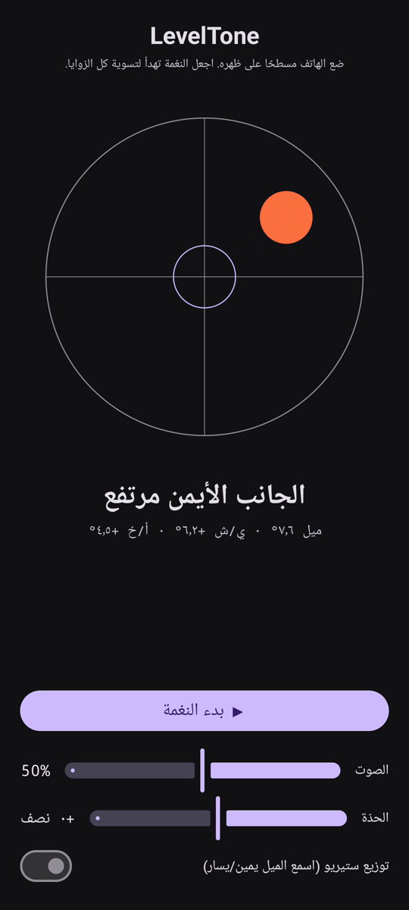

# LevelTone

🌐 اللغات: [English](README.md) · [Nederlands](README.nl.md) · [Deutsch](README.de.md) · [Français](README.fr.md) · [Español](README.es.md) · [Português](README.pt.md) · [Italiano](README.it.md) · [Polski](README.pl.md) · [Русский](README.ru.md) · [Українська](README.uk.md) · [Türkçe](README.tr.md) · [Svenska](README.sv.md) · [Dansk](README.da.md) · [Norsk](README.nb.md) · [Suomi](README.fi.md) · [Čeština](README.cs.md) · [Ελληνικά](README.el.md) · [Română](README.ro.md) · [Magyar](README.hu.md) · [日本語](README.ja.md) · [한국어](README.ko.md) · [简体中文](README.zh-cn.md) · [繁體中文](README.zh-tw.md) · **العربية** · [עברית](README.he.md) · [हिन्दी](README.hi.md) · [ไทย](README.th.md) · [Tiếng Việt](README.vi.md) · [Bahasa Indonesia](README.id.md) · [فارسی](README.fa.md)

> ⚠️ 🌐 *هذه الترجمة آلية ولم يراجعها متحدث أصلي. رأيت خطأً؟ التصحيحات مُرحَّب بها — افتح [PR](../../pulls).*

**ميزان تسوية صوتي** لأندرويد. ضع الهاتف مسطحًا على ظهره ودع أذنيك تقومان بالتسوية:
نغمة توليفية مستمرة تُظهر مدى انحراف السطح عن الاستواء، وصوت **رنين** جرس يؤكد اللحظة التي تستوي
فيها الزوايا الأربع.

## عرض توضيحي (30 ثانية)

**[▶ شاهد العرض التوضيحي لمدة 30 ثانية](https://github.com/youforge-max/LevelTone/raw/main/docs/LevelTone-demo-ar.mp4)** — يميل الهاتف،
وتنجرف الفقاعة نحو الحافة المرتفعة، ثم تستقر خضراء في وسط الهدف عندما يستوي.

> ⚠️ **العرض التوضيحي بلا صوت.** لا يستطيع تسجيل شاشة أندرويد التقاط الصوت الذي يولّده التطبيق،
> لذا الفيديو صامت. على هاتف حقيقي كنت *ستسمع* النغمة ترتفع إلى طبقة ثابتة و**رنين** الجرس عند
> الاستواء — وهذا هو مغزى التطبيق كله.

## كيف يعمل

- **نغمة مستمرة** — بعيدًا عن الاستواء → طبقة منخفضة مع تذبذب سريع؛ كلما اقتربت ارتفعت الطبقة
  وتباطأ التذبذب؛ **مستوٍ تمامًا → نغمة عالية ثابتة** (1318 هرتز).
- **رنين الاستواء** — يصدح جرس متلاشٍ في كل مرة تصل فيها إلى الاستواء، فلا تحتاج حتى إلى النظر
  إلى الشاشة.
- **إشارة الاتجاه** — ميزان فقاعة على الشاشة إضافةً إلى ملصق
  (`الحافة العلوية مرتفعة`، `الجانب الأيسر مرتفع`، … ← `مستوٍ`).
- **شريط الصوت**، وشريط **طبقة قابلة للتعديل** (±1 أوكتاف)، و**توزيع ستيريو اختياري** يحرّك النغمة
  يمينًا/يسارًا مع الميل.

يعمل بلا اتصال تمامًا — لا شبكة، ولا أذونات سوى مستشعر الحركة.

## التثبيت (تحميل جانبي)

LevelTone **غير متوفر على متجر Play** — تثبّته بالتحميل الجانبي:

1. نزّل **`LevelTone.apk`** من [أحدث إصدار](../../releases/latest).
2. افتح الملف. إذا حذّر أندرويد، فانقر **الإعدادات ← السماح من هذا المصدر** ثم أكّد **تثبيت**.
3. افتح التطبيق.

## معلومات مفيدة

- **مجاني** — بلا تكلفة ولا حسابات.
- **بلا إعلانات** — أبدًا. لا متتبعات ولا شبكة.
- **بلا دعم** — تطبيق هواية، كما هو، دون ضمان دعم أو تحديثات. ومع ذلك **تقارير الأخطاء وطلبات السحب
  مرحّب بها** — افتح [issue](../../issues) أو [PR](../../pulls).

---

📘 Manual / 手册 / دليل: [English](MANUAL.md) · [Nederlands](MANUAL.nl.md) · [Deutsch](MANUAL.de.md) · [Français](MANUAL.fr.md) · [Español](MANUAL.es.md) · [Português](MANUAL.pt.md) · [Italiano](MANUAL.it.md) · [Polski](MANUAL.pl.md) · [Русский](MANUAL.ru.md) · [Українська](MANUAL.uk.md) · [Türkçe](MANUAL.tr.md) · [Svenska](MANUAL.sv.md) · [Dansk](MANUAL.da.md) · [Norsk](MANUAL.nb.md) · [Suomi](MANUAL.fi.md) · [Čeština](MANUAL.cs.md) · [Ελληνικά](MANUAL.el.md) · [Română](MANUAL.ro.md) · [Magyar](MANUAL.hu.md) · [日本語](MANUAL.ja.md) · [한국어](MANUAL.ko.md) · [简体中文](MANUAL.zh-cn.md) · [繁體中文](MANUAL.zh-tw.md) · [العربية](MANUAL.ar.md) · [עברית](MANUAL.he.md) · [हिन्दी](MANUAL.hi.md) · [ไทย](MANUAL.th.md) · [Tiếng Việt](MANUAL.vi.md) · [Bahasa Indonesia](MANUAL.id.md) · [فارسی](MANUAL.fa.md)  
🔧 Build instructions, tilt math & license: see the [English README](README.md).

