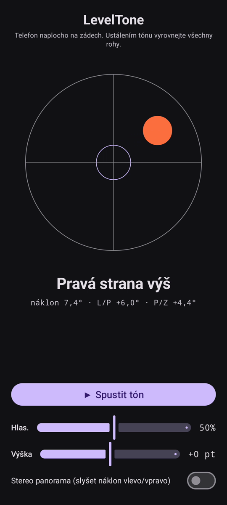

# LevelTone

🌐 Jazyky: [English](README.md) · [Nederlands](README.nl.md) · [Deutsch](README.de.md) · [Français](README.fr.md) · [Español](README.es.md) · [Português](README.pt.md) · [Italiano](README.it.md) · [Polski](README.pl.md) · [Русский](README.ru.md) · [Українська](README.uk.md) · [Türkçe](README.tr.md) · [Svenska](README.sv.md) · [Dansk](README.da.md) · [Norsk](README.nb.md) · [Suomi](README.fi.md) · **Čeština** · [Ελληνικά](README.el.md) · [Română](README.ro.md) · [Magyar](README.hu.md) · [日本語](README.ja.md) · [한국어](README.ko.md) · [简体中文](README.zh-cn.md) · [繁體中文](README.zh-tw.md) · [العربية](README.ar.md) · [עברית](README.he.md) · [हिन्दी](README.hi.md) · [ไทย](README.th.md) · [Tiếng Việt](README.vi.md) · [Bahasa Indonesia](README.id.md) · [فارسی](README.fa.md)

> ⚠️ 🌐 *Tento překlad je strojově vytvořený a nebyl zkontrolován rodilým mluvčím. Vidíš chybu? Opravy jsou vítány — otevři [PR](../../pulls).*

**Zvuková vodováha** pro Android. Položte telefon naplocho na záda a nechte
vyrovnávat své uši: souvislý syntetický tón ukazuje, jak moc je plocha mimo rovinu, a
**pípnutí** zvonku potvrdí okamžik, kdy jsou všechny čtyři rohy vodorovné.

## Ukázka (30 s)

**[▶ Přehrát 30sekundovou ukázku](https://github.com/youforge-max/LevelTone/raw/main/docs/LevelTone-demo-cs.mp4)** — telefon se naklání,
bublina se posouvá k vyššímu okraji a poté se zeleně vystředí na terči, jakmile je vodorovně.

> ⚠️ **Ukázka nemá zvuk.** Nahrávání obrazovky Androidu neumí zachytit zvuk generovaný
> aplikací, takže video je němé. Na skutečném telefonu byste *slyšeli*, jak tón stoupá ke
> stabilní výšce, a **pípnutí** zvonku ve vodorovné poloze — to je celý smysl aplikace.

## Jak to funguje

- **Souvislý tón** — daleko od roviny → nízká výška s rychlým chvěním; s přibližováním k rovině
  výška stoupá a chvění se zpomaluje; **přesně vodorovně → vysoký, stabilní tón** (1318 Hz).
- **Pípnutí roviny** — doznívající zvonek zazní pokaždé, když dosáhnete roviny, takže se ani
  nemusíte dívat na obrazovku.
- **Ukazatel směru** — vodováha na obrazovce plus popisek
  (`Horní hrana výš`, `Levá strana výš`, … → `VODOROVNĚ`).
- **Posuvník hlasitosti**, posuvník **nastavitelné výšky** (±1 oktáva) a **volitelné stereo
  panorama**, které posouvá tón vlevo/vpravo s náklonem.

Zcela offline — žádná síť, žádná oprávnění kromě snímače pohybu.

## Instalace (sideload)

LevelTone **není na Google Play** — instaluje se sideloadem:

1. Stáhněte **`LevelTone.apk`** z [nejnovějšího vydání](../../releases/latest).
2. Otevřete soubor. Pokud Android varuje, klepněte na **Nastavení → Povolit z tohoto zdroje** a
   potvrďte **Instalovat**.
3. Otevřete aplikaci.

## Dobré vědět

- **Zdarma** — bez poplatků, bez účtů.
- **Bez reklam** — nikdy. Žádné sledovače, žádná síť.
- **Bez podpory** — hobby aplikace, tak jak je, bez záruky podpory či aktualizací. Přesto jsou
  **hlášení chyb a pull requesty vítány** — otevřete [issue](../../issues) nebo [PR](../../pulls).

---

📘 Manual / 手册 / دليل: [English](MANUAL.md) · [Nederlands](MANUAL.nl.md) · [Deutsch](MANUAL.de.md) · [Français](MANUAL.fr.md) · [Español](MANUAL.es.md) · [Português](MANUAL.pt.md) · [Italiano](MANUAL.it.md) · [Polski](MANUAL.pl.md) · [Русский](MANUAL.ru.md) · [Українська](MANUAL.uk.md) · [Türkçe](MANUAL.tr.md) · [Svenska](MANUAL.sv.md) · [Dansk](MANUAL.da.md) · [Norsk](MANUAL.nb.md) · [Suomi](MANUAL.fi.md) · [Čeština](MANUAL.cs.md) · [Ελληνικά](MANUAL.el.md) · [Română](MANUAL.ro.md) · [Magyar](MANUAL.hu.md) · [日本語](MANUAL.ja.md) · [한국어](MANUAL.ko.md) · [简体中文](MANUAL.zh-cn.md) · [繁體中文](MANUAL.zh-tw.md) · [العربية](MANUAL.ar.md) · [עברית](MANUAL.he.md) · [हिन्दी](MANUAL.hi.md) · [ไทย](MANUAL.th.md) · [Tiếng Việt](MANUAL.vi.md) · [Bahasa Indonesia](MANUAL.id.md) · [فارسی](MANUAL.fa.md)  
🔧 Build instructions, tilt math & license: see the [English README](README.md).

