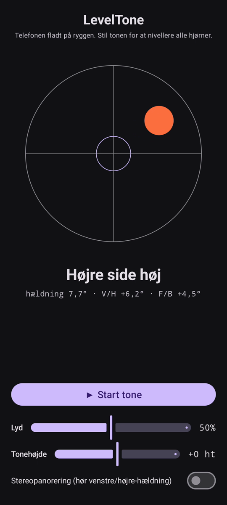

# LevelTone

🌐 Sprog: [English](README.md) · [Nederlands](README.nl.md) · [Deutsch](README.de.md) · [Français](README.fr.md) · [Español](README.es.md) · [Português](README.pt.md) · [Italiano](README.it.md) · [Polski](README.pl.md) · [Русский](README.ru.md) · [Українська](README.uk.md) · [Türkçe](README.tr.md) · [Svenska](README.sv.md) · **Dansk** · [Norsk](README.nb.md) · [Suomi](README.fi.md) · [Čeština](README.cs.md) · [Ελληνικά](README.el.md) · [Română](README.ro.md) · [Magyar](README.hu.md) · [日本語](README.ja.md) · [한국어](README.ko.md) · [简体中文](README.zh-cn.md) · [繁體中文](README.zh-tw.md) · [العربية](README.ar.md) · [עברית](README.he.md) · [हिन्दी](README.hi.md) · [ไทย](README.th.md) · [Tiếng Việt](README.vi.md) · [Bahasa Indonesia](README.id.md) · [فارسی](README.fa.md)

> ⚠️ 🌐 *Denne oversættelse er maskinassisteret og ikke gennemgået af en indfødt taler. Set en fejl? Rettelser er velkomne — åbn en [PR](../../pulls).*

Et **hørbart vaterpas** til Android. Læg telefonen fladt på ryggen, og lad ørerne
klare nivelleringen: en kontinuerlig synthtone viser, hvor meget overfladen hælder, og et
klokke-**bip** bekræfter øjeblikket, hvor alle fire hjørner er i vater.

## Demo (30 s)

**[▶ Se demoen på 30 sekunder](https://github.com/youforge-max/LevelTone/raw/main/docs/LevelTone-demo-da.mp4)** — telefonen hælder, boblen
driver mod den høje kant og lægger sig derefter grøn-centreret på målet, når den bliver i vater.

> ⚠️ **Demoen har ingen lyd.** Androids skærmoptagelse kan ikke fange en apps genererede lyd,
> så videoen er lydløs. På en rigtig telefon ville du *høre* tonen stige til en stabil
> tonehøjde og klokke-**bippet** ved vater — det er hele pointen med appen.

## Sådan virker det

- **Kontinuerlig tone** — langt fra vater → lav tonehøjde med hurtig vibrato; tættere på vater
  stiger tonehøjden, og vibratoen aftager; **præcist i vater → en høj, stabil tone** (1318 Hz).
- **Vater-bip** — en aftagende klokkeklang lyder, hver gang du rammer vater, så du behøver ikke
  engang at se på skærmen.
- **Retningsvisning** — et vaterpas på skærmen plus en etiket
  (`Øverste kant høj`, `Venstre side høj`, … → `I VATER`).
- **Lydstyrkeskyder**, en skyder til **justerbar tonehøjde** (±1 oktav) og en **valgfri
  stereopanorering**, der flytter tonen venstre/højre med hældningen.

Helt offline — intet netværk, ingen tilladelser ud over bevægelsessensoren.

## Installer (sideload)

LevelTone er **ikke på Play Store** — du sideloader det:

1. Download **`LevelTone.apk`** fra [seneste udgivelse](../../releases/latest).
2. Åbn filen. Hvis Android advarer, tryk **Indstillinger → Tillad fra denne kilde**, og bekræft
   **Installer**.
3. Åbn appen.

## Godt at vide

- **Gratis** — ingen omkostning, ingen konti.
- **Reklamefri** — aldrig. Ingen sporere, intet netværk.
- **Ingen support** — hobbyapp, som den er, uden garanti for support eller opdateringer.
  Alligevel er **fejlrapporter og pull requests velkomne** — åbn en [issue](../../issues)
  eller [PR](../../pulls).

---

📘 Manual / 手册 / دليل: [English](MANUAL.md) · [Nederlands](MANUAL.nl.md) · [Deutsch](MANUAL.de.md) · [Français](MANUAL.fr.md) · [Español](MANUAL.es.md) · [Português](MANUAL.pt.md) · [Italiano](MANUAL.it.md) · [Polski](MANUAL.pl.md) · [Русский](MANUAL.ru.md) · [Українська](MANUAL.uk.md) · [Türkçe](MANUAL.tr.md) · [Svenska](MANUAL.sv.md) · [Dansk](MANUAL.da.md) · [Norsk](MANUAL.nb.md) · [Suomi](MANUAL.fi.md) · [Čeština](MANUAL.cs.md) · [Ελληνικά](MANUAL.el.md) · [Română](MANUAL.ro.md) · [Magyar](MANUAL.hu.md) · [日本語](MANUAL.ja.md) · [한국어](MANUAL.ko.md) · [简体中文](MANUAL.zh-cn.md) · [繁體中文](MANUAL.zh-tw.md) · [العربية](MANUAL.ar.md) · [עברית](MANUAL.he.md) · [हिन्दी](MANUAL.hi.md) · [ไทย](MANUAL.th.md) · [Tiếng Việt](MANUAL.vi.md) · [Bahasa Indonesia](MANUAL.id.md) · [فارسی](MANUAL.fa.md)  
🔧 Build instructions, tilt math & license: see the [English README](README.md).

