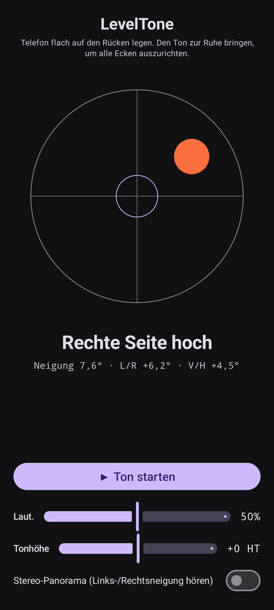

# LevelTone

🌐 Sprachen: [English](README.md) · [Nederlands](README.nl.md) · **Deutsch** · [Français](README.fr.md) · [Español](README.es.md) · [Português](README.pt.md) · [Italiano](README.it.md) · [Polski](README.pl.md) · [Русский](README.ru.md) · [Українська](README.uk.md) · [Türkçe](README.tr.md) · [Svenska](README.sv.md) · [Dansk](README.da.md) · [Norsk](README.nb.md) · [Suomi](README.fi.md) · [Čeština](README.cs.md) · [Ελληνικά](README.el.md) · [Română](README.ro.md) · [Magyar](README.hu.md) · [日本語](README.ja.md) · [한국어](README.ko.md) · [简体中文](README.zh-cn.md) · [繁體中文](README.zh-tw.md) · [العربية](README.ar.md) · [עברית](README.he.md) · [हिन्दी](README.hi.md) · [ไทย](README.th.md) · [Tiếng Việt](README.vi.md) · [Bahasa Indonesia](README.id.md) · [فارسی](README.fa.md)

> ⚠️ 🌐 *Diese Übersetzung ist maschinell erstellt und nicht von einem Muttersprachler geprüft. Fehler entdeckt? Korrekturen sind willkommen — öffne einen [PR](../../pulls).*

Eine **akustische Wasserwaage** für Android. Leg dein Telefon flach auf den Rücken und
lass deine Ohren die Ausrichtung übernehmen: ein durchgehender Synthesizer-Ton zeigt an,
wie weit die Oberfläche außer der Waage liegt, und ein Glocken-**Ping** bestätigt den
Moment, in dem alle vier Ecken waagerecht sind.

<p align="center">
  
</p>

## Demo (30 s)

<a href="https://github.com/youforge-max/LevelTone/raw/main/docs/LevelTone-demo-de.mp4"></a>

**[▶ Die 30-Sekunden-Demo ansehen](https://github.com/youforge-max/LevelTone/raw/main/docs/LevelTone-demo-de.mp4)** —
das Telefon kippt, die Blase driftet zur hohen Kante und kommt dann grün-zentriert auf
dem Ziel zur Ruhe, sobald es waagerecht ist.

> ⚠️ **Die Demo hat keinen Ton.** Die Bildschirmaufnahme von Android kann den vom App
> erzeugten Klang nicht erfassen, daher ist das Video stumm. Auf einem echten Telefon
> würdest du den Ton *hören*, wie er zu einer stabilen Tonhöhe ansteigt, und den
> Glocken-**Ping** bei Waagerecht — genau darum geht es bei der App. Siehe
> [Wie es funktioniert](#wie-es-funktioniert), was du hören würdest.

## Wie es funktioniert

- **Durchgehender Ton** — weit außer der Waage → tiefe Tonhöhe mit schnellem Amplituden-
  Wobbeln; je näher an waagerecht, desto höher die Tonhöhe und langsamer das Wobbeln;
  **exakt waagerecht → ein hoher, stabiler Ton** (1318 Hz).
- **Waagerecht-Ping** — ein ausklingender Glockenton erklingt jedes Mal, wenn du
  waagerecht wirst, sodass du nicht einmal auf den Bildschirm schauen musst.
- **Richtungsanzeige** — eine Wasserwaage auf dem Bildschirm plus ein Label (`Oberkante hoch`,
  `Linke Seite hoch`, … → `WAAGERECHT`) sagt dir, in welche Richtung es kippt.
- **Lautstärkeregler**, ein **einstellbarer Tonhöhen**-Regler (transponiere den ganzen Ton
  um bis zu ±1 Oktave in einen für deine Ohren angenehmen Bereich) und ein **optionaler
  Stereo-Panorama**-Schalter (standardmäßig aus), der den Ton mit der Neigung links/rechts
  schwenkt.

Vollständig offline — kein Netzwerk, keine Berechtigungen außer dem Bewegungssensor.

## Installieren (Sideloading)

LevelTone ist **nicht im Play Store** — du sideloadest es:

1. Lade **`LevelTone.apk`** aus dem [neuesten Release](../../releases/latest) herunter.
2. Öffne die Datei. Wenn Android warnt, tippe auf **Einstellungen → Aus dieser Quelle
   zulassen** und bestätige dann **Installieren**.
3. Öffne die App.

Siehe das **[Handbuch](MANUAL.de.md)** dafür, wie man etwas nach Gehör ausrichtet.

## Gut zu wissen

- **Kostenlos** — keine Kosten, keine Konten.
- **Werbefrei** — nie Werbung. Keine Tracker, kein Netzwerk.
- **Kein Support** — dies ist eine Hobby-App, bereitgestellt wie besehen, ohne Garantie
  auf Support oder Updates. Dennoch sind **Fehlerberichte und Pull Requests willkommen** —
  öffne ein [Issue](../../issues) oder einen [PR](../../pulls).

## Bauen

```bash
export ANDROID_HOME=~/android-sdk
./gradlew :app:assembleDebug
# -> app/build/outputs/apk/debug/app-debug.apk
```

- Kotlin + Jetpack Compose (Material 3, dunkel)
- `SensorManager` `TYPE_GRAVITY` (fällt auf einen tiefpassgefilterten Beschleunigungssensor zurück)
- Streaming-`AudioTrack`-Sinus-Synth mit klickfreier One-Pole-Glättung
- minSdk 24 · compileSdk 35 · Paket `eu.cisodiagonal.leveltone`

## Neigungsmathematik

Bildschirmnormalen-Neigung = `acos(gz / |g|)` (0° = flach). Roll `atan2(gx, gz)` und Pitch
`atan2(gy, gz)` liefern die Links/Rechts- und Vorne/Hinten-Komponenten, die die Blase und
das Richtungslabel ansteuern.

## Lizenz

MIT
