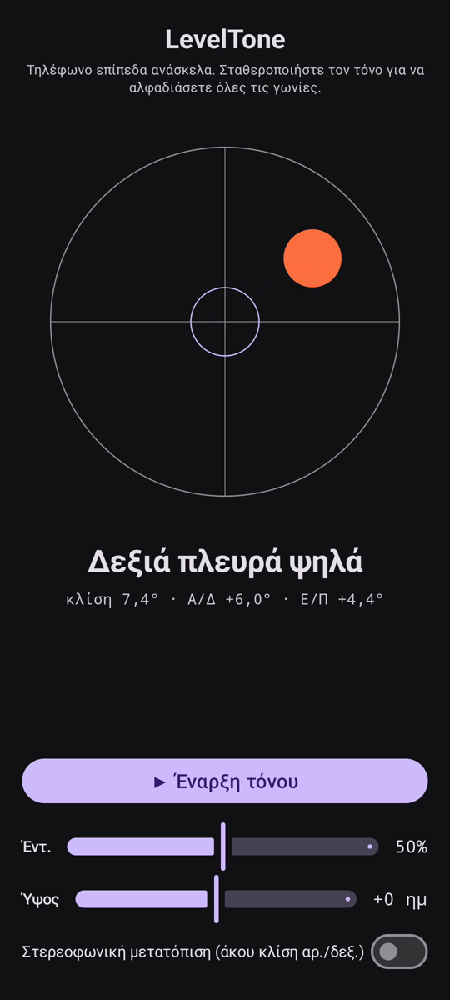

# LevelTone

🌐 Γλώσσες: [English](README.md) · [Nederlands](README.nl.md) · [Deutsch](README.de.md) · [Français](README.fr.md) · [Español](README.es.md) · [Português](README.pt.md) · [Italiano](README.it.md) · [Polski](README.pl.md) · [Русский](README.ru.md) · [Українська](README.uk.md) · [Türkçe](README.tr.md) · [Svenska](README.sv.md) · [Dansk](README.da.md) · [Norsk](README.nb.md) · [Suomi](README.fi.md) · [Čeština](README.cs.md) · **Ελληνικά** · [Română](README.ro.md) · [Magyar](README.hu.md) · [日本語](README.ja.md) · [한국어](README.ko.md) · [简体中文](README.zh-cn.md) · [繁體中文](README.zh-tw.md) · [العربية](README.ar.md) · [עברית](README.he.md) · [हिन्दी](README.hi.md) · [ไทย](README.th.md) · [Tiếng Việt](README.vi.md) · [Bahasa Indonesia](README.id.md) · [فارسی](README.fa.md)

> ⚠️ 🌐 *Αυτή η μετάφραση έγινε με μηχανή και δεν έχει ελεγχθεί από φυσικό ομιλητή. Είδες λάθος; Οι διορθώσεις είναι ευπρόσδεκτες — άνοιξε ένα [PR](../../pulls).*

Ένα **ηχητικό αλφάδι** για Android. Ακούμπησε το τηλέφωνο επίπεδα ανάσκελα και
άσε τα αυτιά σου να κάνουν το αλφάδιασμα: ένας συνεχής συνθετικός τόνος δείχνει πόσο εκτός
οριζοντίου είναι η επιφάνεια, και ένα **μπιπ** καμπάνας επιβεβαιώνει τη στιγμή που και οι
τέσσερις γωνίες είναι στο αλφάδι.

## Επίδειξη (30 δλ)

**[▶ Δες την επίδειξη 30 δευτερολέπτων](https://github.com/youforge-max/LevelTone/raw/main/docs/LevelTone-demo-el.mp4)** — το τηλέφωνο
γέρνει, η φυσαλίδα κινείται προς την ψηλή άκρη και μετά σταθεροποιείται πράσινη-κεντραρισμένη
στον στόχο μόλις έρθει στο αλφάδι.

> ⚠️ **Η επίδειξη δεν έχει ήχο.** Η εγγραφή οθόνης του Android δεν μπορεί να συλλάβει τον ήχο
> που παράγει μια εφαρμογή, οπότε το βίντεο είναι βουβό. Σε πραγματικό τηλέφωνο θα *άκουγες* τον
> τόνο να ανεβαίνει σε σταθερό ύψος και το **μπιπ** καμπάνας στο αλφάδι — αυτό είναι όλο το νόημα.

## Πώς λειτουργεί

- **Συνεχής τόνος** — πολύ εκτός αλφαδιού → χαμηλό ύψος με γρήγορη ταλάντωση· καθώς πλησιάζεις,
  το ύψος ανεβαίνει και η ταλάντωση επιβραδύνεται· **ακριβώς στο αλφάδι → ψηλός, σταθερός τόνος**
  (1318 Hz).
- **Μπιπ αλφαδιού** — ένα καμπανάκι που σβήνει ηχεί κάθε φορά που φτάνεις στο αλφάδι, οπότε δεν
  χρειάζεται καν να κοιτάς την οθόνη.
- **Ένδειξη κατεύθυνσης** — ένα αλφάδι στην οθόνη συν μια ετικέτα
  (`Πάνω άκρη ψηλά`, `Αριστερή πλευρά ψηλά`, … → `ΑΛΦΑΔΙ`).
- **Ολισθητής έντασης**, ολισθητής **ρυθμιζόμενου ύψους** (±1 οκτάβα) και **προαιρετικό στερεοφωνικό
  πανοράμα** που μετατοπίζει τον τόνο αριστερά/δεξιά με την κλίση.

Πλήρως εκτός σύνδεσης — χωρίς δίκτυο, χωρίς άδειες πέραν του αισθητήρα κίνησης.

## Εγκατάσταση (sideload)

Το LevelTone **δεν είναι στο Play Store** — το εγκαθιστάς με sideload:

1. Κατέβασε το **`LevelTone.apk`** από την [τελευταία έκδοση](../../releases/latest).
2. Άνοιξε το αρχείο. Αν το Android προειδοποιήσει, πάτησε **Ρυθμίσεις → Να επιτρέπεται από αυτή
   την πηγή** και επιβεβαίωσε **Εγκατάσταση**.
3. Άνοιξε την εφαρμογή.

## Καλό να ξέρεις

- **Δωρεάν** — χωρίς κόστος, χωρίς λογαριασμούς.
- **Χωρίς διαφημίσεις** — ποτέ. Χωρίς ιχνηλάτες, χωρίς δίκτυο.
- **Χωρίς υποστήριξη** — ερασιτεχνική εφαρμογή, ως έχει, χωρίς εγγύηση υποστήριξης ή
  ενημερώσεων. Παρ' όλα αυτά, **αναφορές σφαλμάτων και pull requests είναι ευπρόσδεκτα** — άνοιξε
  ένα [issue](../../issues) ή ένα [PR](../../pulls).

---

📘 Manual / 手册 / دليل: [English](MANUAL.md) · [Nederlands](MANUAL.nl.md) · [Deutsch](MANUAL.de.md) · [Français](MANUAL.fr.md) · [Español](MANUAL.es.md) · [Português](MANUAL.pt.md) · [Italiano](MANUAL.it.md) · [Polski](MANUAL.pl.md) · [Русский](MANUAL.ru.md) · [Українська](MANUAL.uk.md) · [Türkçe](MANUAL.tr.md) · [Svenska](MANUAL.sv.md) · [Dansk](MANUAL.da.md) · [Norsk](MANUAL.nb.md) · [Suomi](MANUAL.fi.md) · [Čeština](MANUAL.cs.md) · [Ελληνικά](MANUAL.el.md) · [Română](MANUAL.ro.md) · [Magyar](MANUAL.hu.md) · [日本語](MANUAL.ja.md) · [한국어](MANUAL.ko.md) · [简体中文](MANUAL.zh-cn.md) · [繁體中文](MANUAL.zh-tw.md) · [العربية](MANUAL.ar.md) · [עברית](MANUAL.he.md) · [हिन्दी](MANUAL.hi.md) · [ไทย](MANUAL.th.md) · [Tiếng Việt](MANUAL.vi.md) · [Bahasa Indonesia](MANUAL.id.md) · [فارسی](MANUAL.fa.md)  
🔧 Build instructions, tilt math & license: see the [English README](README.md).

