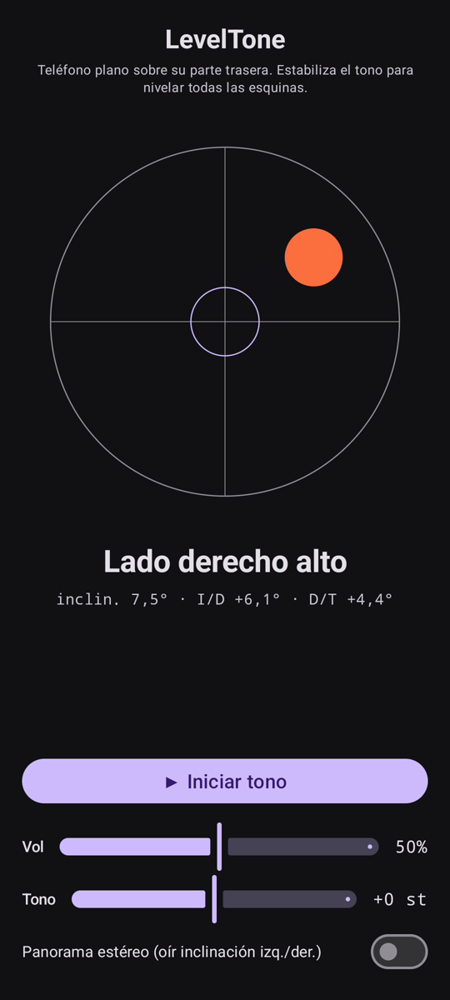

# LevelTone

🌐 Idiomas: [English](README.md) · [Nederlands](README.nl.md) · [Deutsch](README.de.md) · [Français](README.fr.md) · **Español** · [Português](README.pt.md) · [Italiano](README.it.md) · [Polski](README.pl.md) · [Русский](README.ru.md) · [Українська](README.uk.md) · [Türkçe](README.tr.md) · [Svenska](README.sv.md) · [Dansk](README.da.md) · [Norsk](README.nb.md) · [Suomi](README.fi.md) · [Čeština](README.cs.md) · [Ελληνικά](README.el.md) · [Română](README.ro.md) · [Magyar](README.hu.md) · [日本語](README.ja.md) · [한국어](README.ko.md) · [简体中文](README.zh-cn.md) · [繁體中文](README.zh-tw.md) · [العربية](README.ar.md) · [עברית](README.he.md) · [हिन्दी](README.hi.md) · [ไทย](README.th.md) · [Tiếng Việt](README.vi.md) · [Bahasa Indonesia](README.id.md) · [فارسی](README.fa.md)

> ⚠️ 🌐 *Esta traducción es asistida por máquina y no ha sido revisada por un hablante nativo. ¿Ves un error? Las correcciones son bienvenidas — abre un [PR](../../pulls).*

Un **nivel de burbuja sonoro** para Android. Apoya el teléfono plano sobre su parte
trasera y deja que tus oídos hagan la nivelación: un tono de síntesis continuo indica cuánto
se desvía la superficie del nivel, y un **bip** de campana confirma el momento en que las
cuatro esquinas quedan niveladas.

## Demostración (30 s)

**[▶ Ver la demostración de 30 segundos](https://github.com/youforge-max/LevelTone/raw/main/docs/LevelTone-demo-es.mp4)** — el teléfono se
inclina, la burbuja deriva hacia el borde alto y luego se estabiliza centrada en verde sobre
el objetivo cuando queda nivelado.

> ⚠️ **La demostración no tiene sonido.** La grabación de pantalla de Android no puede captar
> el sonido generado por una app, así que el vídeo es mudo. En un teléfono real *oirías* el
> tono subir hasta una altura estable y el **bip** de campana al nivelar — ese es todo el
> sentido de la app.

## Cómo funciona

- **Tono continuo** — muy fuera de nivel → altura baja con una oscilación rápida; al acercarte
  al nivel la altura sube y la oscilación se ralentiza; **perfectamente nivelado → un tono
  agudo y estable** (1318 Hz).
- **Bip de nivel** — un carillón de campana que decae suena cada vez que cruzas al nivel, así
  ni siquiera necesitas mirar la pantalla.
- **Indicación de dirección** — un nivel de burbuja en pantalla más una etiqueta
  (`Borde superior alto`, `Lado izquierdo alto`, … → `NIVELADO`).
- **Control de volumen**, un control de **altura ajustable** (±1 octava) y un **panorama
  estéreo opcional** que desplaza el tono a izquierda/derecha con la inclinación.

Totalmente sin conexión — sin red, sin permisos aparte del sensor de movimiento.

## Instalar (sideload)

LevelTone **no está en Play Store** — se instala por sideload:

1. Descarga **`LevelTone.apk`** desde la [última versión](../../releases/latest).
2. Abre el archivo. Si Android advierte, toca **Ajustes → Permitir de esta fuente** y confirma
   **Instalar**.
3. Abre la app.

## Bueno saber

- **Gratis** — sin coste ni cuentas.
- **Sin anuncios** — nunca. Sin rastreadores, sin red.
- **Sin soporte** — app de aficionado, tal cual, sin garantía de soporte ni actualizaciones.
  Aun así, **los informes de errores y pull requests son bienvenidos** — abre una
  [incidencia](../../issues) o un [PR](../../pulls).

---

📘 Manual / 手册 / دليل: [English](MANUAL.md) · [Nederlands](MANUAL.nl.md) · [Deutsch](MANUAL.de.md) · [Français](MANUAL.fr.md) · [Español](MANUAL.es.md) · [Português](MANUAL.pt.md) · [Italiano](MANUAL.it.md) · [Polski](MANUAL.pl.md) · [Русский](MANUAL.ru.md) · [Українська](MANUAL.uk.md) · [Türkçe](MANUAL.tr.md) · [Svenska](MANUAL.sv.md) · [Dansk](MANUAL.da.md) · [Norsk](MANUAL.nb.md) · [Suomi](MANUAL.fi.md) · [Čeština](MANUAL.cs.md) · [Ελληνικά](MANUAL.el.md) · [Română](MANUAL.ro.md) · [Magyar](MANUAL.hu.md) · [日本語](MANUAL.ja.md) · [한국어](MANUAL.ko.md) · [简体中文](MANUAL.zh-cn.md) · [繁體中文](MANUAL.zh-tw.md) · [العربية](MANUAL.ar.md) · [עברית](MANUAL.he.md) · [हिन्दी](MANUAL.hi.md) · [ไทย](MANUAL.th.md) · [Tiếng Việt](MANUAL.vi.md) · [Bahasa Indonesia](MANUAL.id.md) · [فارسی](MANUAL.fa.md)  
🔧 Build instructions, tilt math & license: see the [English README](README.md).

