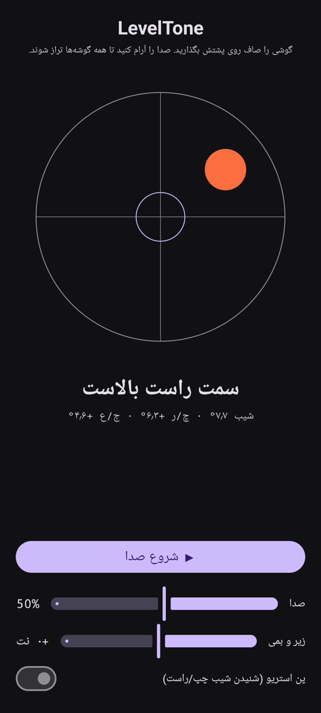

# LevelTone

🌐 زبان‌ها: [English](README.md) · [Nederlands](README.nl.md) · [Deutsch](README.de.md) · [Français](README.fr.md) · [Español](README.es.md) · [Português](README.pt.md) · [Italiano](README.it.md) · [Polski](README.pl.md) · [Русский](README.ru.md) · [Українська](README.uk.md) · [Türkçe](README.tr.md) · [Svenska](README.sv.md) · [Dansk](README.da.md) · [Norsk](README.nb.md) · [Suomi](README.fi.md) · [Čeština](README.cs.md) · [Ελληνικά](README.el.md) · [Română](README.ro.md) · [Magyar](README.hu.md) · [日本語](README.ja.md) · [한국어](README.ko.md) · [简体中文](README.zh-cn.md) · [繁體中文](README.zh-tw.md) · [العربية](README.ar.md) · [עברית](README.he.md) · [हिन्दी](README.hi.md) · [ไทย](README.th.md) · [Tiếng Việt](README.vi.md) · [Bahasa Indonesia](README.id.md) · **فارسی**

> ⚠️ 🌐 *این ترجمه ماشینی است و توسط گویشور بومی بازبینی نشده است. خطایی دیدید؟ از اصلاحات استقبال می‌شود — یک [PR](../../pulls) باز کنید.*

یک **تراز صوتی** برای اندروید. گوشی را صاف روی پشتش بگذارید و بگذارید گوش‌هایتان
تراز کنند: یک نُت پیوستهٔ سینت نشان می‌دهد سطح چقدر از تراز خارج است، و یک **بیپ** زنگ لحظه‌ای را
که هر چهار گوشه تراز می‌شوند تأیید می‌کند.

## نمایش (۳۰ ثانیه)

**[▶ تماشای نمایش ۳۰ ثانیه‌ای](https://github.com/youforge-max/LevelTone/raw/main/docs/LevelTone-demo-fa.mp4)** — گوشی کج می‌شود، حباب به
سمت لبهٔ بلند می‌رود، سپس هنگام تراز شدن سبز و در مرکز هدف آرام می‌گیرد.

> ⚠️ **نمایش صدا ندارد.** ضبط صفحهٔ اندروید نمی‌تواند صدای تولیدشده توسط برنامه را ثبت کند، پس
> ویدیو بی‌صداست. روی گوشی واقعی *می‌شنیدید* که نُت تا یک زیرِ ثابت بالا می‌رود و **بیپ** زنگ در
> تراز — و این تمام هدف برنامه است.

## چطور کار می‌کند

- **نُت پیوسته** — دور از تراز → زیرِ پایین با لرزش سریع؛ هرچه نزدیک‌تر شوید زیر بالا می‌رود و
  لرزش کند می‌شود؛ **دقیقاً تراز → یک نُت بلند و پایدار** (۱۳۱۸ هرتز).
- **بیپ تراز** — هر بار که به تراز می‌رسید یک زنگ محوشونده به صدا درمی‌آید، پس حتی لازم نیست به
  صفحه نگاه کنید.
- **نشان جهت** — یک تراز حبابی روی صفحه به‌همراه یک برچسب
  (`لبه بالا بالاست`، `سمت چپ بالاست`، … ← `تراز`).
- **لغزندهٔ صدا**، لغزندهٔ **زیر و بمی قابل‌تنظیم** (±۱ اکتاو)، و **پن استریوی اختیاری** که نُت را
  با کجی به چپ/راست جابه‌جا می‌کند.

کاملاً آفلاین — بدون شبکه، بدون مجوزی جز حسگر حرکت.

## نصب (ساید‌لود)

‏LevelTone **در Play Store نیست** — آن را با ساید‌لود نصب می‌کنید:

1. **`LevelTone.apk`** را از [آخرین نسخه](../../releases/latest) دانلود کنید.
2. فایل را باز کنید. اگر اندروید هشدار داد، روی **تنظیمات ← اجازه از این منبع** بزنید و **نصب** را
   تأیید کنید.
3. برنامه را باز کنید.

## خوب است بدانید

- **رایگان** — بدون هزینه، بدون حساب.
- **بدون تبلیغ** — هرگز. بدون ردیاب، بدون شبکه.
- **بدون پشتیبانی** — برنامهٔ تفریحی، همان‌طور که هست، بدون تضمین پشتیبانی یا به‌روزرسانی. با این
  حال **گزارش اشکال و pull request خوش‌آمد است** — یک [issue](../../issues) یا [PR](../../pulls) باز کنید.

---

📘 Manual / 手册 / دليل: [English](MANUAL.md) · [Nederlands](MANUAL.nl.md) · [Deutsch](MANUAL.de.md) · [Français](MANUAL.fr.md) · [Español](MANUAL.es.md) · [Português](MANUAL.pt.md) · [Italiano](MANUAL.it.md) · [Polski](MANUAL.pl.md) · [Русский](MANUAL.ru.md) · [Українська](MANUAL.uk.md) · [Türkçe](MANUAL.tr.md) · [Svenska](MANUAL.sv.md) · [Dansk](MANUAL.da.md) · [Norsk](MANUAL.nb.md) · [Suomi](MANUAL.fi.md) · [Čeština](MANUAL.cs.md) · [Ελληνικά](MANUAL.el.md) · [Română](MANUAL.ro.md) · [Magyar](MANUAL.hu.md) · [日本語](MANUAL.ja.md) · [한국어](MANUAL.ko.md) · [简体中文](MANUAL.zh-cn.md) · [繁體中文](MANUAL.zh-tw.md) · [العربية](MANUAL.ar.md) · [עברית](MANUAL.he.md) · [हिन्दी](MANUAL.hi.md) · [ไทย](MANUAL.th.md) · [Tiếng Việt](MANUAL.vi.md) · [Bahasa Indonesia](MANUAL.id.md) · [فارسی](MANUAL.fa.md)  
🔧 Build instructions, tilt math & license: see the [English README](README.md).

