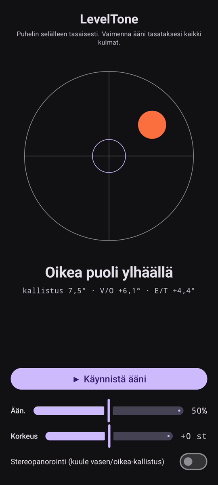

# LevelTone

🌐 Kielet: [English](README.md) · [Nederlands](README.nl.md) · [Deutsch](README.de.md) · [Français](README.fr.md) · [Español](README.es.md) · [Português](README.pt.md) · [Italiano](README.it.md) · [Polski](README.pl.md) · [Русский](README.ru.md) · [Українська](README.uk.md) · [Türkçe](README.tr.md) · [Svenska](README.sv.md) · [Dansk](README.da.md) · [Norsk](README.nb.md) · **Suomi** · [Čeština](README.cs.md) · [Ελληνικά](README.el.md) · [Română](README.ro.md) · [Magyar](README.hu.md) · [日本語](README.ja.md) · [한국어](README.ko.md) · [简体中文](README.zh-cn.md) · [繁體中文](README.zh-tw.md) · [العربية](README.ar.md) · [עברית](README.he.md) · [हिन्दी](README.hi.md) · [ไทย](README.th.md) · [Tiếng Việt](README.vi.md) · [Bahasa Indonesia](README.id.md) · [فارسی](README.fa.md)

> ⚠️ 🌐 *Tämä käännös on koneellinen eikä äidinkielisen puhujan tarkistama. Näitkö virheen? Korjaukset ovat tervetulleita — avaa [PR](../../pulls).*

**Kuultava vesivaaka** Androidille. Aseta puhelin tasaisesti selälleen ja anna
korvien hoitaa vaaitus: jatkuva syntetisoitu ääni kertoo, kuinka paljon pinta on vinossa, ja
kellon **piippaus** vahvistaa hetken, jolloin kaikki neljä kulmaa ovat vaakasuorassa.

## Esittely (30 s)

**[▶ Katso 30 sekunnin esittely](https://github.com/youforge-max/LevelTone/raw/main/docs/LevelTone-demo-fi.mp4)** — puhelin kallistuu,
kupla ajautuu korkealle reunalle ja asettuu sitten vihreänä keskitettynä kohteeseen, kun se on
vaakasuorassa.

> ⚠️ **Esittelyssä ei ole ääntä.** Androidin näytön tallennus ei voi kaapata sovelluksen
> tuottamaa ääntä, joten video on mykkä. Oikealla puhelimella *kuulisit* äänen nousevan
> vakaaseen korkeuteen ja kellon **piippauksen** vaa'assa — siinä on koko sovelluksen idea.

## Miten se toimii

- **Jatkuva ääni** — kaukana vaa'asta → matala korkeus nopealla värähtelyllä; lähestyttäessä
  korkeus nousee ja värähtely hidastuu; **täsmälleen vaa'assa → korkea, vakaa ääni** (1318 Hz).
- **Vaakapiippaus** — vaimeneva kellonsointi kuuluu joka kerta, kun saavutat vaa'an, joten sinun
  ei tarvitse edes katsoa näyttöä.
- **Suunnan osoitin** — vesivaaka näytöllä sekä nimike
  (`Yläreuna ylhäällä`, `Vasen puoli ylhäällä`, … → `VAAKA`).
- **Äänenvoimakkuuden liukusäädin**, **säädettävän korkeuden** liukusäädin (±1 oktaavi) ja
  **valinnainen stereopanorointi**, joka siirtää ääntä vasemmalle/oikealle kallistuksen mukaan.

Täysin offline — ei verkkoa, ei käyttöoikeuksia liikeanturia lukuun ottamatta.

## Asennus (sivulataus)

LevelTone **ei ole Play Kaupassa** — se sivuladataan:

1. Lataa **`LevelTone.apk`** [uusimmasta julkaisusta](../../releases/latest).
2. Avaa tiedosto. Jos Android varoittaa, napauta **Asetukset → Salli tästä lähteestä** ja
   vahvista **Asenna**.
3. Avaa sovellus.

## Hyvä tietää

- **Ilmainen** — ei maksua, ei tilejä.
- **Mainokseton** — ei koskaan. Ei seurantaa, ei verkkoa.
- **Ei tukea** — harrastussovellus, sellaisenaan, ilman takuuta tuesta tai päivityksistä.
  Silti **virheraportit ja pull-pyynnöt ovat tervetulleita** — avaa [issue](../../issues) tai
  [PR](../../pulls).

---

📘 Manual / 手册 / دليل: [English](MANUAL.md) · [Nederlands](MANUAL.nl.md) · [Deutsch](MANUAL.de.md) · [Français](MANUAL.fr.md) · [Español](MANUAL.es.md) · [Português](MANUAL.pt.md) · [Italiano](MANUAL.it.md) · [Polski](MANUAL.pl.md) · [Русский](MANUAL.ru.md) · [Українська](MANUAL.uk.md) · [Türkçe](MANUAL.tr.md) · [Svenska](MANUAL.sv.md) · [Dansk](MANUAL.da.md) · [Norsk](MANUAL.nb.md) · [Suomi](MANUAL.fi.md) · [Čeština](MANUAL.cs.md) · [Ελληνικά](MANUAL.el.md) · [Română](MANUAL.ro.md) · [Magyar](MANUAL.hu.md) · [日本語](MANUAL.ja.md) · [한국어](MANUAL.ko.md) · [简体中文](MANUAL.zh-cn.md) · [繁體中文](MANUAL.zh-tw.md) · [العربية](MANUAL.ar.md) · [עברית](MANUAL.he.md) · [हिन्दी](MANUAL.hi.md) · [ไทย](MANUAL.th.md) · [Tiếng Việt](MANUAL.vi.md) · [Bahasa Indonesia](MANUAL.id.md) · [فارسی](MANUAL.fa.md)  
🔧 Build instructions, tilt math & license: see the [English README](README.md).

