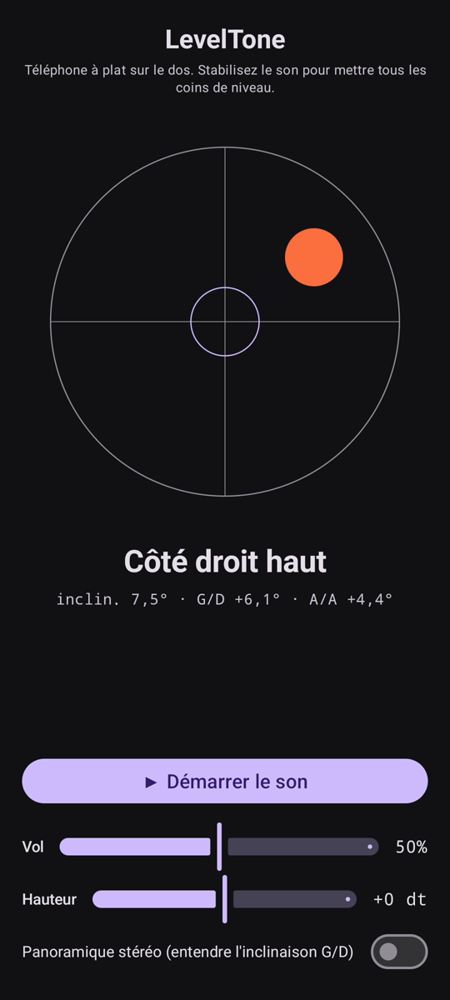

# LevelTone

🌐 Langues: [English](README.md) · [Nederlands](README.nl.md) · [Deutsch](README.de.md) · **Français** · [Español](README.es.md) · [Português](README.pt.md) · [Italiano](README.it.md) · [Polski](README.pl.md) · [Русский](README.ru.md) · [Українська](README.uk.md) · [Türkçe](README.tr.md) · [Svenska](README.sv.md) · [Dansk](README.da.md) · [Norsk](README.nb.md) · [Suomi](README.fi.md) · [Čeština](README.cs.md) · [Ελληνικά](README.el.md) · [Română](README.ro.md) · [Magyar](README.hu.md) · [日本語](README.ja.md) · [한국어](README.ko.md) · [简体中文](README.zh-cn.md) · [繁體中文](README.zh-tw.md) · [العربية](README.ar.md) · [עברית](README.he.md) · [हिन्दी](README.hi.md) · [ไทย](README.th.md) · [Tiếng Việt](README.vi.md) · [Bahasa Indonesia](README.id.md) · [فارسی](README.fa.md)

> ⚠️ 🌐 *Cette traduction est générée par machine et non relue par un locuteur natif. Une erreur ? Les corrections sont les bienvenues — ouvrez une [PR](../../pulls).*

Un **niveau à bulle sonore** pour Android. Posez votre téléphone à plat sur le dos et
laissez vos oreilles faire la mise à niveau : un son de synthèse continu suit l'écart du
plan par rapport à l'horizontale, et un **bip** de cloche confirme l'instant où les quatre
coins sont de niveau.

<p align="center">
  
</p>

## Démo (30 s)

<a href="https://github.com/youforge-max/LevelTone/raw/main/docs/LevelTone-demo-fr.mp4"></a>

**[▶ Regarder la démo de 30 secondes](https://github.com/youforge-max/LevelTone/raw/main/docs/LevelTone-demo-fr.mp4)** —
le téléphone s'incline, la bulle dérive vers le bord haut, puis se stabilise centrée en
vert sur la cible dès qu'il est de niveau.

> ⚠️ **La démo est sans son.** L'enregistrement d'écran d'Android ne peut pas capter le son
> généré par une application, la vidéo est donc muette. Sur un vrai téléphone, vous
> *entendriez* le son monter jusqu'à une hauteur stable et le **bip** de cloche au niveau —
> c'est tout l'intérêt de l'application. Voir [Comment ça marche](#comment-ça-marche) pour
> ce que vous entendriez.

## Comment ça marche

- **Son continu** — loin du niveau → hauteur basse avec une oscillation d'amplitude rapide ;
  à mesure que vous approchez du niveau, la hauteur monte et l'oscillation ralentit ;
  **parfaitement de niveau → un son aigu et stable** (1318 Hz).
- **Bip de niveau** — un carillon de cloche déclinant retentit chaque fois que vous passez
  au niveau, si bien que vous n'avez même pas besoin de regarder l'écran.
- **Indication de direction** — un niveau à bulle à l'écran plus une étiquette
  (`Bord supérieur haut`, `Côté gauche haut`, … → `DE NIVEAU`) indique de quel côté il penche.
- **Curseur de volume**, un curseur de **hauteur réglable** (transposez tout le son jusqu'à
  ±1 octave vers une plage agréable pour vos oreilles) et un commutateur de **panoramique
  stéréo optionnel** (désactivé par défaut) qui déplace le son à gauche/droite avec l'inclinaison.

Entièrement hors ligne — pas de réseau, aucune autorisation en dehors du capteur de mouvement.

## Installer (chargement latéral)

LevelTone n'est **pas sur le Play Store** — vous le chargez latéralement :

1. Téléchargez **`LevelTone.apk`** depuis la [dernière version](../../releases/latest).
2. Ouvrez le fichier. Si Android avertit, appuyez sur **Paramètres → Autoriser cette source**,
   puis confirmez **Installer**.
3. Ouvrez l'application.

Consultez le **[Manuel](MANUAL.fr.md)** pour savoir comment mettre quelque chose de niveau à l'oreille.

## Bon à savoir

- **Gratuit** — sans coût, sans compte.
- **Sans publicité** — jamais de pub. Pas de traceurs, pas de réseau.
- **Sans assistance** — c'est une application de loisir, fournie telle quelle, sans garantie
  d'assistance ni de mises à jour. Cela dit, **les rapports de bugs et les pull requests sont
  les bienvenus** — ouvrez une [issue](../../issues) ou une [PR](../../pulls).

## Compiler

```bash
export ANDROID_HOME=~/android-sdk
./gradlew :app:assembleDebug
# -> app/build/outputs/apk/debug/app-debug.apk
```

- Kotlin + Jetpack Compose (Material 3, sombre)
- `SensorManager` `TYPE_GRAVITY` (bascule sur un accéléromètre filtré passe-bas)
- Synthé sinusoïdal `AudioTrack` en streaming avec lissage one-pole sans clic
- minSdk 24 · compileSdk 35 · paquet `eu.cisodiagonal.leveltone`

## Calcul d'inclinaison

Inclinaison de la normale à l'écran = `acos(gz / |g|)` (0° = à plat). Le roulis `atan2(gx, gz)`
et le tangage `atan2(gy, gz)` donnent les composantes gauche/droite et avant/arrière qui
pilotent la bulle et l'étiquette de direction.

## Licence

MIT
