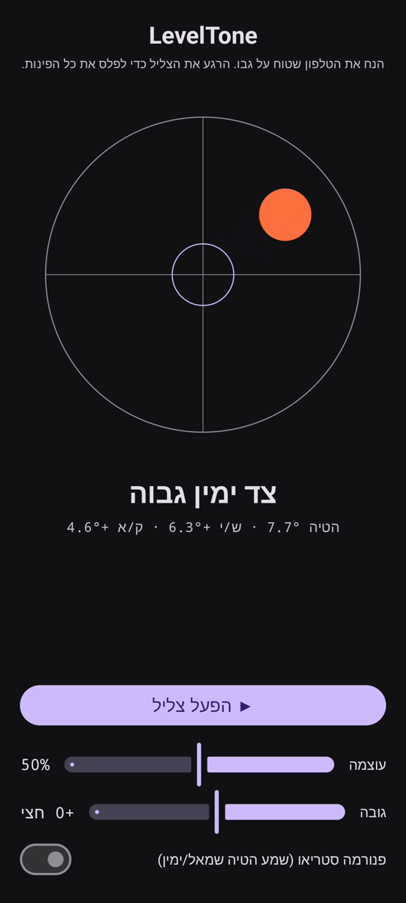

# LevelTone

🌐 שפות: [English](README.md) · [Nederlands](README.nl.md) · [Deutsch](README.de.md) · [Français](README.fr.md) · [Español](README.es.md) · [Português](README.pt.md) · [Italiano](README.it.md) · [Polski](README.pl.md) · [Русский](README.ru.md) · [Українська](README.uk.md) · [Türkçe](README.tr.md) · [Svenska](README.sv.md) · [Dansk](README.da.md) · [Norsk](README.nb.md) · [Suomi](README.fi.md) · [Čeština](README.cs.md) · [Ελληνικά](README.el.md) · [Română](README.ro.md) · [Magyar](README.hu.md) · [日本語](README.ja.md) · [한국어](README.ko.md) · [简体中文](README.zh-cn.md) · [繁體中文](README.zh-tw.md) · [العربية](README.ar.md) · **עברית** · [हिन्दी](README.hi.md) · [ไทย](README.th.md) · [Tiếng Việt](README.vi.md) · [Bahasa Indonesia](README.id.md) · [فارسی](README.fa.md)

> ⚠️ 🌐 *תרגום זה נעשה במכונה ולא נבדק בידי דובר שפת אם. ראית טעות? תיקונים מתקבלים בברכה — פתח [PR](../../pulls).*

**פלס קולי** לאנדרואיד. הנח את הטלפון שטוח על גבו ותן לאוזניים לפלס: צליל סינתטי
רציף מציין כמה המשטח סוטה מהמאוזן, וצליל **פינג** של פעמון מאשר את הרגע שבו כל ארבע הפינות
מפולסות.

## הדגמה (30 שנ')

**[▶ צפו בהדגמה של 30 שניות](https://github.com/youforge-max/LevelTone/raw/main/docs/LevelTone-demo-he.mp4)** — הטלפון מוטה, הבועה נסחפת אל
הקצה הגבוה, ואז מתייצבת ירוקה וממורכזת על המטרה כשהוא מתפלס.

> ⚠️ **בהדגמה אין קול.** הקלטת המסך של אנדרואיד אינה יכולה ללכוד את הצליל שהאפליקציה מייצרת, ולכן
> הסרטון אילם. בטלפון אמיתי היית *שומע* את הצליל עולה לגובה יציב ואת ה**פינג** של הפעמון בהתפלסות —
> זו כל מטרת האפליקציה.

## איך זה עובד

- **צליל רציף** — רחוק מהמאוזן → גובה נמוך עם רעד מהיר; ככל שמתקרבים הגובה עולה והרעד מאט;
  **מאוזן בדיוק → צליל גבוה ויציב** (1318 הרץ).
- **פינג התפלסות** — צלצול פעמון דועך נשמע בכל פעם שמגיעים למאוזן, כך שאין צורך אפילו להביט במסך.
- **חיווי כיוון** — פלס בועה על המסך ותווית
  (`הקצה העליון גבוה`, `צד שמאל גבוה`, … ← `מפולס`).
- **מחוון עוצמה**, מחוון **גובה מתכוונן** (±1 אוקטבה), ו**פנורמת סטריאו אופציונלית** שמזיזה את
  הצליל שמאלה/ימינה עם ההטיה.

לא מקוון לחלוטין — ללא רשת, ללא הרשאות מלבד חיישן התנועה.

## התקנה (טעינה צדדית)

‏LevelTone **אינו בחנות Play** — מתקינים בטעינה צדדית:

1. הורידו את **`LevelTone.apk`** מ[הגרסה האחרונה](../../releases/latest).
2. פתחו את הקובץ. אם אנדרואיד מזהיר, הקישו **הגדרות ← אפשר ממקור זה** ואשרו **התקן**.
3. פתחו את האפליקציה.

## כדאי לדעת

- **חינם** — ללא עלות וללא חשבונות.
- **ללא פרסומות** — לעולם. ללא עוקבים, ללא רשת.
- **ללא תמיכה** — אפליקציית תחביב, כפי שהיא, ללא אחריות לתמיכה או עדכונים. עם זאת **דיווחי באגים
  ובקשות משיכה יתקבלו בברכה** — פתחו [issue](../../issues) או [PR](../../pulls).

---

📘 Manual / 手册 / دليل: [English](MANUAL.md) · [Nederlands](MANUAL.nl.md) · [Deutsch](MANUAL.de.md) · [Français](MANUAL.fr.md) · [Español](MANUAL.es.md) · [Português](MANUAL.pt.md) · [Italiano](MANUAL.it.md) · [Polski](MANUAL.pl.md) · [Русский](MANUAL.ru.md) · [Українська](MANUAL.uk.md) · [Türkçe](MANUAL.tr.md) · [Svenska](MANUAL.sv.md) · [Dansk](MANUAL.da.md) · [Norsk](MANUAL.nb.md) · [Suomi](MANUAL.fi.md) · [Čeština](MANUAL.cs.md) · [Ελληνικά](MANUAL.el.md) · [Română](MANUAL.ro.md) · [Magyar](MANUAL.hu.md) · [日本語](MANUAL.ja.md) · [한국어](MANUAL.ko.md) · [简体中文](MANUAL.zh-cn.md) · [繁體中文](MANUAL.zh-tw.md) · [العربية](MANUAL.ar.md) · [עברית](MANUAL.he.md) · [हिन्दी](MANUAL.hi.md) · [ไทย](MANUAL.th.md) · [Tiếng Việt](MANUAL.vi.md) · [Bahasa Indonesia](MANUAL.id.md) · [فارسی](MANUAL.fa.md)  
🔧 Build instructions, tilt math & license: see the [English README](README.md).

