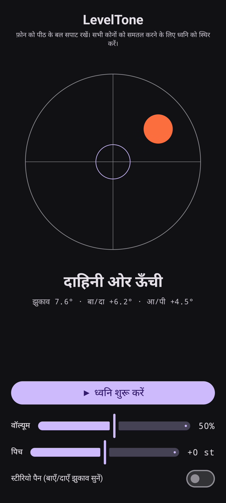

# LevelTone

🌐 भाषाएँ: [English](README.md) · [Nederlands](README.nl.md) · [Deutsch](README.de.md) · [Français](README.fr.md) · [Español](README.es.md) · [Português](README.pt.md) · [Italiano](README.it.md) · [Polski](README.pl.md) · [Русский](README.ru.md) · [Українська](README.uk.md) · [Türkçe](README.tr.md) · [Svenska](README.sv.md) · [Dansk](README.da.md) · [Norsk](README.nb.md) · [Suomi](README.fi.md) · [Čeština](README.cs.md) · [Ελληνικά](README.el.md) · [Română](README.ro.md) · [Magyar](README.hu.md) · [日本語](README.ja.md) · [한국어](README.ko.md) · [简体中文](README.zh-cn.md) · [繁體中文](README.zh-tw.md) · [العربية](README.ar.md) · [עברית](README.he.md) · **हिन्दी** · [ไทย](README.th.md) · [Tiếng Việt](README.vi.md) · [Bahasa Indonesia](README.id.md) · [فارسی](README.fa.md)

> ⚠️ 🌐 *यह अनुवाद मशीन-सहायित है और किसी मूल वक्ता द्वारा जाँचा नहीं गया है। कोई गलती दिखी? सुधार का स्वागत है — एक [PR](../../pulls) खोलें।*

Android के लिए एक **सुनाई देने वाला जल-स्तर (लेवल)**। फ़ोन को पीठ के बल सपाट रखें और
समतल करने का काम अपने कानों पर छोड़ दें: एक सतत सिंथ ध्वनि बताती है कि सतह कितनी असमतल है, और एक
घंटी की **पिंग** उस पल की पुष्टि करती है जब चारों कोने समतल हो जाते हैं।

## डेमो (30 से)

**[▶ 30 सेकंड का डेमो देखें](https://github.com/youforge-max/LevelTone/raw/main/docs/LevelTone-demo-hi.mp4)** — फ़ोन झुकता है, बुलबुला ऊँचे
किनारे की ओर बहता है, फिर समतल होते ही लक्ष्य पर हरे रंग में केंद्रित होकर स्थिर हो जाता है।

> ⚠️ **डेमो में कोई ध्वनि नहीं है।** Android की स्क्रीन रिकॉर्डिंग किसी ऐप की उत्पन्न ध्वनि नहीं
> पकड़ सकती, इसलिए वीडियो मूक है। असली फ़ोन पर आप ध्वनि को एक स्थिर पिच तक चढ़ते और समतल पर घंटी की
> **पिंग** *सुनेंगे* — यही ऐप का पूरा उद्देश्य है।

## यह कैसे काम करता है

- **सतत ध्वनि** — समतल से बहुत दूर → तेज़ कंपन के साथ नीची पिच; समतल के पास पहुँचते ही पिच चढ़ती
  है और कंपन धीमा होता है; **बिलकुल समतल → ऊँची, स्थिर ध्वनि** (1318 Hz)।
- **समतल पिंग** — हर बार समतल पर पहुँचते ही एक क्षीण होती घंटी बजती है, इसलिए आपको स्क्रीन देखने
  की भी ज़रूरत नहीं।
- **दिशा संकेत** — स्क्रीन पर एक बुलबुला लेवल और एक लेबल
  (`ऊपरी किनारा ऊँचा`, `बाईं ओर ऊँची`, … → `समतल`)।
- **वॉल्यूम स्लाइडर**, एक **समायोज्य पिच** स्लाइडर (±1 सप्तक), और झुकाव के साथ ध्वनि को बाएँ/दाएँ
  खिसकाने वाला **वैकल्पिक स्टीरियो पैन**।

पूरी तरह ऑफ़लाइन — कोई नेटवर्क नहीं, गति सेंसर के अलावा कोई अनुमति नहीं।

## इंस्टॉल (साइडलोड)

LevelTone **Play Store पर नहीं है** — आप इसे साइडलोड करते हैं:

1. [नवीनतम रिलीज़](../../releases/latest) से **`LevelTone.apk`** डाउनलोड करें।
2. फ़ाइल खोलें। यदि Android चेतावनी दे, तो **सेटिंग → इस स्रोत से अनुमति दें** पर टैप करें और
   **इंस्टॉल** की पुष्टि करें।
3. ऐप खोलें।

## जानना अच्छा है

- **मुफ़्त** — कोई शुल्क नहीं, कोई खाता नहीं।
- **विज्ञापन-मुक्त** — कभी नहीं। कोई ट्रैकर नहीं, कोई नेटवर्क नहीं।
- **कोई सहायता नहीं** — शौकिया ऐप, जैसा है वैसा, सहायता या अपडेट की गारंटी के बिना। फिर भी
  **बग रिपोर्ट और पुल रिक्वेस्ट का स्वागत है** — एक [issue](../../issues) या [PR](../../pulls) खोलें।

---

📘 Manual / 手册 / دليل: [English](MANUAL.md) · [Nederlands](MANUAL.nl.md) · [Deutsch](MANUAL.de.md) · [Français](MANUAL.fr.md) · [Español](MANUAL.es.md) · [Português](MANUAL.pt.md) · [Italiano](MANUAL.it.md) · [Polski](MANUAL.pl.md) · [Русский](MANUAL.ru.md) · [Українська](MANUAL.uk.md) · [Türkçe](MANUAL.tr.md) · [Svenska](MANUAL.sv.md) · [Dansk](MANUAL.da.md) · [Norsk](MANUAL.nb.md) · [Suomi](MANUAL.fi.md) · [Čeština](MANUAL.cs.md) · [Ελληνικά](MANUAL.el.md) · [Română](MANUAL.ro.md) · [Magyar](MANUAL.hu.md) · [日本語](MANUAL.ja.md) · [한국어](MANUAL.ko.md) · [简体中文](MANUAL.zh-cn.md) · [繁體中文](MANUAL.zh-tw.md) · [العربية](MANUAL.ar.md) · [עברית](MANUAL.he.md) · [हिन्दी](MANUAL.hi.md) · [ไทย](MANUAL.th.md) · [Tiếng Việt](MANUAL.vi.md) · [Bahasa Indonesia](MANUAL.id.md) · [فارسی](MANUAL.fa.md)  
🔧 Build instructions, tilt math & license: see the [English README](README.md).

