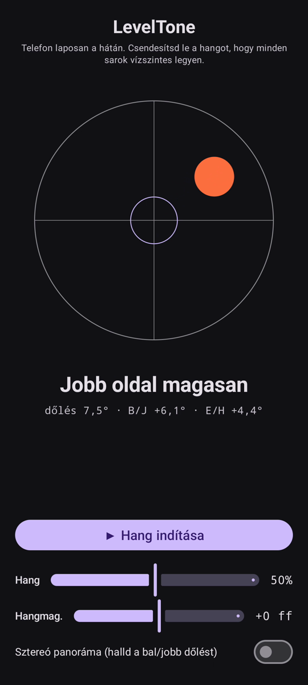

# LevelTone

🌐 Nyelvek: [English](README.md) · [Nederlands](README.nl.md) · [Deutsch](README.de.md) · [Français](README.fr.md) · [Español](README.es.md) · [Português](README.pt.md) · [Italiano](README.it.md) · [Polski](README.pl.md) · [Русский](README.ru.md) · [Українська](README.uk.md) · [Türkçe](README.tr.md) · [Svenska](README.sv.md) · [Dansk](README.da.md) · [Norsk](README.nb.md) · [Suomi](README.fi.md) · [Čeština](README.cs.md) · [Ελληνικά](README.el.md) · [Română](README.ro.md) · **Magyar** · [日本語](README.ja.md) · [한국어](README.ko.md) · [简体中文](README.zh-cn.md) · [繁體中文](README.zh-tw.md) · [العربية](README.ar.md) · [עברית](README.he.md) · [हिन्दी](README.hi.md) · [ไทย](README.th.md) · [Tiếng Việt](README.vi.md) · [Bahasa Indonesia](README.id.md) · [فارسی](README.fa.md)

> ⚠️ 🌐 *Ez a fordítás gépi és nem ellenőrizte anyanyelvi beszélő. Hibát láttál? A javítások szívesen látottak — nyiss egy [PR](../../pulls)-t.*

**Hallható vízszintmérő** Androidra. Fektesd a telefont laposan a hátára, és bízd
a szintezést a füledre: egy folytonos szintetizátorhang jelzi, mennyire tér el a felület a
vízszintestől, egy csengő **csippanás** pedig megerősíti a pillanatot, amikor mind a négy
sarok vízszintes.

## Bemutató (30 mp)

**[▶ Nézd meg a 30 másodperces bemutatót](https://github.com/youforge-max/LevelTone/raw/main/docs/LevelTone-demo-hu.mp4)** — a telefon
megdől, a buborék a magas él felé sodródik, majd zölden középre áll a célon, amint vízszintes lesz.

> ⚠️ **A bemutatónak nincs hangja.** Az Android képernyőfelvétele nem tudja rögzíteni az
> alkalmazás által keltett hangot, ezért a videó néma. Igazi telefonon *hallanád*, ahogy a hang
> stabil magasságra emelkedik, és a csengő **csippanását** vízszintesnél — ez az egész lényeg.

## Hogyan működik

- **Folytonos hang** — messze a vízszintestől → mély hangmagasság gyors rezgéssel; ahogy közeledsz,
  a hangmagasság emelkedik, a rezgés lassul; **pontosan vízszintes → magas, stabil hang** (1318 Hz).
- **Vízszint-csippanás** — egy elhaló csengőhang szól minden alkalommal, amikor eléred a
  vízszintest, így nem is kell a képernyőt nézned.
- **Iránymutatás** — egy vízszintmérő a képernyőn, plusz egy címke
  (`Felső él magasan`, `Bal oldal magasan`, … → `VÍZSZINTES`).
- **Hangerő-csúszka**, egy **állítható hangmagasság** csúszka (±1 oktáv) és egy **opcionális
  sztereó panoráma**, amely a dőléssel balra/jobbra tolja a hangot.

Teljesen offline — nincs hálózat, a mozgásérzékelőn kívül nincs engedély.

## Telepítés (sideload)

A LevelTone **nincs a Play Áruházban** — sideloaddal telepíted:

1. Töltsd le a **`LevelTone.apk`**-t a [legújabb kiadásból](../../releases/latest).
2. Nyisd meg a fájlt. Ha az Android figyelmeztet, koppints a **Beállítások → Engedélyezés ebből
   a forrásból** lehetőségre, majd erősítsd meg a **Telepítés**-t.
3. Nyisd meg az alkalmazást.

## Jó tudni

- **Ingyenes** — nincs költség, nincs fiók.
- **Reklámmentes** — soha. Nincs nyomkövető, nincs hálózat.
- **Nincs támogatás** — hobbialkalmazás, adott állapotában, támogatási vagy frissítési garancia
  nélkül. Ettől még **a hibajelentések és pull requestek szívesen látottak** — nyiss egy
  [issue-t](../../issues) vagy egy [PR-t](../../pulls).

---

📘 Manual / 手册 / دليل: [English](MANUAL.md) · [Nederlands](MANUAL.nl.md) · [Deutsch](MANUAL.de.md) · [Français](MANUAL.fr.md) · [Español](MANUAL.es.md) · [Português](MANUAL.pt.md) · [Italiano](MANUAL.it.md) · [Polski](MANUAL.pl.md) · [Русский](MANUAL.ru.md) · [Українська](MANUAL.uk.md) · [Türkçe](MANUAL.tr.md) · [Svenska](MANUAL.sv.md) · [Dansk](MANUAL.da.md) · [Norsk](MANUAL.nb.md) · [Suomi](MANUAL.fi.md) · [Čeština](MANUAL.cs.md) · [Ελληνικά](MANUAL.el.md) · [Română](MANUAL.ro.md) · [Magyar](MANUAL.hu.md) · [日本語](MANUAL.ja.md) · [한국어](MANUAL.ko.md) · [简体中文](MANUAL.zh-cn.md) · [繁體中文](MANUAL.zh-tw.md) · [العربية](MANUAL.ar.md) · [עברית](MANUAL.he.md) · [हिन्दी](MANUAL.hi.md) · [ไทย](MANUAL.th.md) · [Tiếng Việt](MANUAL.vi.md) · [Bahasa Indonesia](MANUAL.id.md) · [فارسی](MANUAL.fa.md)  
🔧 Build instructions, tilt math & license: see the [English README](README.md).

