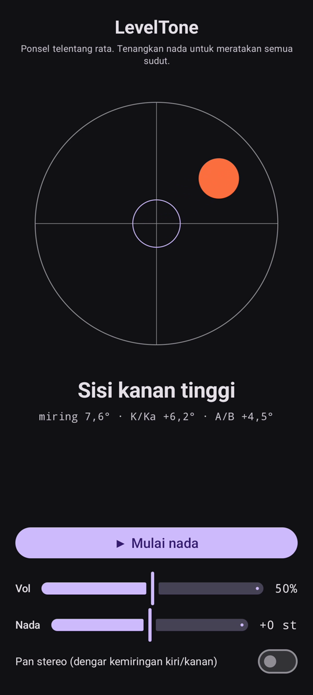

# LevelTone

🌐 Bahasa: [English](README.md) · [Nederlands](README.nl.md) · [Deutsch](README.de.md) · [Français](README.fr.md) · [Español](README.es.md) · [Português](README.pt.md) · [Italiano](README.it.md) · [Polski](README.pl.md) · [Русский](README.ru.md) · [Українська](README.uk.md) · [Türkçe](README.tr.md) · [Svenska](README.sv.md) · [Dansk](README.da.md) · [Norsk](README.nb.md) · [Suomi](README.fi.md) · [Čeština](README.cs.md) · [Ελληνικά](README.el.md) · [Română](README.ro.md) · [Magyar](README.hu.md) · [日本語](README.ja.md) · [한국어](README.ko.md) · [简体中文](README.zh-cn.md) · [繁體中文](README.zh-tw.md) · [العربية](README.ar.md) · [עברית](README.he.md) · [हिन्दी](README.hi.md) · [ไทย](README.th.md) · [Tiếng Việt](README.vi.md) · **Bahasa Indonesia** · [فارسی](README.fa.md)

> ⚠️ 🌐 *Terjemahan ini dibantu mesin dan belum ditinjau oleh penutur asli. Menemukan kesalahan? Koreksi diterima dengan senang hati — buka [PR](../../pulls).*

**Waterpas suara** untuk Android. Letakkan ponsel telentang rata dan biarkan
telinga Anda meratakannya: nada sintesis kontinu menunjukkan seberapa miring permukaan, dan
**bip** lonceng menegaskan saat keempat sudut sudah rata.

## Demo (30 dtk)

**[▶ Tonton demo 30 detik](https://github.com/youforge-max/LevelTone/raw/main/docs/LevelTone-demo-id.mp4)** — ponsel miring, gelembung
melayang ke tepi yang tinggi, lalu berhenti hijau di tengah target saat rata.

> ⚠️ **Demo tidak bersuara.** Perekaman layar Android tidak dapat menangkap suara yang
> dihasilkan aplikasi, jadi videonya bisu. Di ponsel sungguhan Anda akan *mendengar* nada naik
> ke tinggi yang stabil dan **bip** lonceng saat rata — itulah inti aplikasi ini.

## Cara kerja

- **Nada kontinu** — jauh dari rata → nada rendah dengan getaran cepat; semakin dekat, nada
  naik dan getaran melambat; **tepat rata → nada tinggi yang stabil** (1318 Hz).
- **Bip rata** — dentang lonceng yang meredup berbunyi setiap kali Anda mencapai rata, jadi
  Anda bahkan tak perlu melihat layar.
- **Petunjuk arah** — waterpas di layar plus label
  (`Tepi atas tinggi`, `Sisi kiri tinggi`, … → `RATA`).
- **Penggeser volume**, penggeser **nada yang dapat disetel** (±1 oktaf), dan **pan stereo
  opsional** yang menggeser nada kiri/kanan mengikuti kemiringan.

Sepenuhnya luring — tanpa jaringan, tanpa izin selain sensor gerak.

## Pasang (sideload)

LevelTone **tidak ada di Play Store** — Anda memasangnya lewat sideload:

1. Unduh **`LevelTone.apk`** dari [rilis terbaru](../../releases/latest).
2. Buka berkasnya. Jika Android memperingatkan, ketuk **Setelan → Izinkan dari sumber ini** lalu
   konfirmasi **Pasang**.
3. Buka aplikasi.

## Baik untuk diketahui

- **Gratis** — tanpa biaya, tanpa akun.
- **Bebas iklan** — selamanya. Tanpa pelacak, tanpa jaringan.
- **Tanpa dukungan** — aplikasi hobi, apa adanya, tanpa jaminan dukungan atau pembaruan. Meski
  begitu, **laporan bug dan pull request disambut baik** — buka [issue](../../issues) atau
  [PR](../../pulls).

---

📘 Manual / 手册 / دليل: [English](MANUAL.md) · [Nederlands](MANUAL.nl.md) · [Deutsch](MANUAL.de.md) · [Français](MANUAL.fr.md) · [Español](MANUAL.es.md) · [Português](MANUAL.pt.md) · [Italiano](MANUAL.it.md) · [Polski](MANUAL.pl.md) · [Русский](MANUAL.ru.md) · [Українська](MANUAL.uk.md) · [Türkçe](MANUAL.tr.md) · [Svenska](MANUAL.sv.md) · [Dansk](MANUAL.da.md) · [Norsk](MANUAL.nb.md) · [Suomi](MANUAL.fi.md) · [Čeština](MANUAL.cs.md) · [Ελληνικά](MANUAL.el.md) · [Română](MANUAL.ro.md) · [Magyar](MANUAL.hu.md) · [日本語](MANUAL.ja.md) · [한국어](MANUAL.ko.md) · [简体中文](MANUAL.zh-cn.md) · [繁體中文](MANUAL.zh-tw.md) · [العربية](MANUAL.ar.md) · [עברית](MANUAL.he.md) · [हिन्दी](MANUAL.hi.md) · [ไทย](MANUAL.th.md) · [Tiếng Việt](MANUAL.vi.md) · [Bahasa Indonesia](MANUAL.id.md) · [فارسی](MANUAL.fa.md)  
🔧 Build instructions, tilt math & license: see the [English README](README.md).

