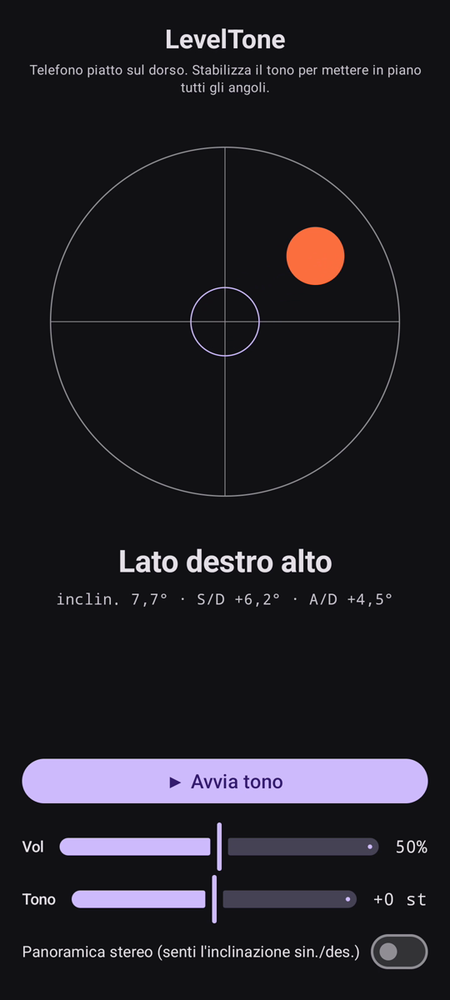

# LevelTone

🌐 Lingue: [English](README.md) · [Nederlands](README.nl.md) · [Deutsch](README.de.md) · [Français](README.fr.md) · [Español](README.es.md) · [Português](README.pt.md) · **Italiano** · [Polski](README.pl.md) · [Русский](README.ru.md) · [Українська](README.uk.md) · [Türkçe](README.tr.md) · [Svenska](README.sv.md) · [Dansk](README.da.md) · [Norsk](README.nb.md) · [Suomi](README.fi.md) · [Čeština](README.cs.md) · [Ελληνικά](README.el.md) · [Română](README.ro.md) · [Magyar](README.hu.md) · [日本語](README.ja.md) · [한국어](README.ko.md) · [简体中文](README.zh-cn.md) · [繁體中文](README.zh-tw.md) · [العربية](README.ar.md) · [עברית](README.he.md) · [हिन्दी](README.hi.md) · [ไทย](README.th.md) · [Tiếng Việt](README.vi.md) · [Bahasa Indonesia](README.id.md) · [فارسی](README.fa.md)

> ⚠️ 🌐 *Questa traduzione è assistita da macchina e non è stata rivista da un madrelingua. Trovato un errore? Le correzioni sono benvenute — apri una [PR](../../pulls).*

Una **livella a bolla sonora** per Android. Appoggia il telefono piatto sul dorso
e lascia che siano le orecchie a metterlo in piano: un tono di sintesi continuo indica quanto
la superficie è fuori piano, e un **bip** di campana conferma il momento in cui tutti e quattro
gli angoli sono in piano.

## Dimostrazione (30 s)

**[▶ Guarda la demo di 30 secondi](https://github.com/youforge-max/LevelTone/raw/main/docs/LevelTone-demo-it.mp4)** — il telefono si inclina,
la bolla scivola verso il bordo alto, poi si stabilizza centrata in verde sul bersaglio quando
è in piano.

> ⚠️ **La demo non ha audio.** La registrazione dello schermo di Android non può catturare il
> suono generato da un'app, quindi il video è muto. Su un telefono vero *sentiresti* il tono
> salire fino a un'altezza stabile e il **bip** di campana in piano — è tutto il senso dell'app.

## Come funziona

- **Tono continuo** — molto fuori piano → altezza bassa con oscillazione rapida; avvicinandoti
  al piano l'altezza sale e l'oscillazione rallenta; **perfettamente in piano → un tono acuto e
  stabile** (1318 Hz).
- **Bip di livello** — un rintocco di campana che sfuma suona ogni volta che raggiungi il
  piano, così non devi nemmeno guardare lo schermo.
- **Indicazione di direzione** — una livella a bolla sullo schermo più un'etichetta
  (`Bordo superiore alto`, `Lato sinistro alto`, … → `IN PIANO`).
- **Cursore volume**, un cursore di **altezza regolabile** (±1 ottava) e un **panorama stereo
  opzionale** che sposta il tono a sinistra/destra con l'inclinazione.

Completamente offline — nessuna rete, nessun permesso oltre al sensore di movimento.

## Installare (sideload)

LevelTone **non è sul Play Store** — si installa con sideload:

1. Scarica **`LevelTone.apk`** dall'[ultima release](../../releases/latest).
2. Apri il file. Se Android avvisa, tocca **Impostazioni → Consenti da questa origine** e
   conferma **Installa**.
3. Apri l'app.

## Buono a sapersi

- **Gratis** — nessun costo, nessun account.
- **Senza pubblicità** — mai. Nessun tracker, nessuna rete.
- **Nessun supporto** — app per hobby, così com'è, senza garanzia di supporto o aggiornamenti.
  Detto ciò, **segnalazioni di bug e pull request sono benvenute** — apri una
  [issue](../../issues) o una [PR](../../pulls).

---

📘 Manual / 手册 / دليل: [English](MANUAL.md) · [Nederlands](MANUAL.nl.md) · [Deutsch](MANUAL.de.md) · [Français](MANUAL.fr.md) · [Español](MANUAL.es.md) · [Português](MANUAL.pt.md) · [Italiano](MANUAL.it.md) · [Polski](MANUAL.pl.md) · [Русский](MANUAL.ru.md) · [Українська](MANUAL.uk.md) · [Türkçe](MANUAL.tr.md) · [Svenska](MANUAL.sv.md) · [Dansk](MANUAL.da.md) · [Norsk](MANUAL.nb.md) · [Suomi](MANUAL.fi.md) · [Čeština](MANUAL.cs.md) · [Ελληνικά](MANUAL.el.md) · [Română](MANUAL.ro.md) · [Magyar](MANUAL.hu.md) · [日本語](MANUAL.ja.md) · [한국어](MANUAL.ko.md) · [简体中文](MANUAL.zh-cn.md) · [繁體中文](MANUAL.zh-tw.md) · [العربية](MANUAL.ar.md) · [עברית](MANUAL.he.md) · [हिन्दी](MANUAL.hi.md) · [ไทย](MANUAL.th.md) · [Tiếng Việt](MANUAL.vi.md) · [Bahasa Indonesia](MANUAL.id.md) · [فارسی](MANUAL.fa.md)  
🔧 Build instructions, tilt math & license: see the [English README](README.md).

