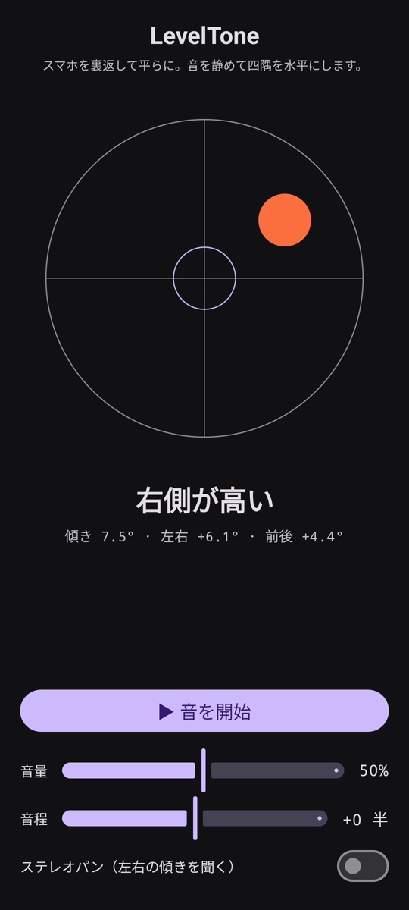

# LevelTone

🌐 言語: [English](README.md) · [Nederlands](README.nl.md) · [Deutsch](README.de.md) · [Français](README.fr.md) · [Español](README.es.md) · [Português](README.pt.md) · [Italiano](README.it.md) · [Polski](README.pl.md) · [Русский](README.ru.md) · [Українська](README.uk.md) · [Türkçe](README.tr.md) · [Svenska](README.sv.md) · [Dansk](README.da.md) · [Norsk](README.nb.md) · [Suomi](README.fi.md) · [Čeština](README.cs.md) · [Ελληνικά](README.el.md) · [Română](README.ro.md) · [Magyar](README.hu.md) · **日本語** · [한국어](README.ko.md) · [简体中文](README.zh-cn.md) · [繁體中文](README.zh-tw.md) · [العربية](README.ar.md) · [עברית](README.he.md) · [हिन्दी](README.hi.md) · [ไทย](README.th.md) · [Tiếng Việt](README.vi.md) · [Bahasa Indonesia](README.id.md) · [فارسی](README.fa.md)

> ⚠️ 🌐 *この翻訳は機械によるもので、ネイティブスピーカーの確認を受けていません。誤りを見つけたら、修正は歓迎します — [PR](../../pulls) を開いてください。*

Android 用の**音で分かる水準器**。スマホを裏返して平らに置き、水平出しは耳に任せます。
連続する合成音が面の傾き具合を示し、四隅が水平になった瞬間をベルの**ピン**音が知らせます。

## デモ（30 秒）

**[▶ 30秒のデモを見る](https://github.com/youforge-max/LevelTone/raw/main/docs/LevelTone-demo-ja.mp4)** — スマホが傾くと気泡が高い縁へ流れ、
水平になるとターゲット上に緑色で中央に収まります。

> ⚠️ **デモに音声はありません。** Android の画面録画はアプリが生成する音を捉えられないため、
> 動画は無音です。実機では音が安定した高さまで上がり、水平でベルが**ピン**と鳴るのが *聞こえます* —
> それがこのアプリの要点です。

## 仕組み

- **連続音** — 水平から大きく外れる → 低い音程で速く揺れる。近づくほど音程が上がり揺れが遅くなる。
  **ぴったり水平 → 高く安定した音**（1318 Hz）。
- **水平ピン音** — 水平に入るたびに減衰するベル音が鳴るので、画面を見る必要すらありません。
- **方向表示** — 画面上の気泡水準器とラベル（`上端が高い`、`左側が高い`、… → `水平`）。
- **音量スライダー**、**音程調整**スライダー（±1 オクターブ）、傾きに合わせて音を左右に振る
  **任意のステレオパン**。

完全オフライン — ネットワーク不要、モーションセンサー以外の権限なし。

## インストール（サイドロード）

LevelTone は **Play ストアにありません** — サイドロードします：

1. [最新リリース](../../releases/latest)から **`LevelTone.apk`** をダウンロード。
2. ファイルを開きます。Android が警告したら **設定 → このソースを許可** をタップし、**インストール**
   を確定します。
3. アプリを開きます。

## 知っておくと良いこと

- **無料** — 費用なし、アカウントなし。
- **広告なし** — 一切なし。トラッカーなし、ネットワークなし。
- **サポートなし** — 趣味のアプリで、現状のまま、サポートや更新の保証はありません。それでも
  **バグ報告とプルリクエストは歓迎します** — [issue](../../issues) や [PR](../../pulls) を開いてください。

---

📘 Manual / 手册 / دليل: [English](MANUAL.md) · [Nederlands](MANUAL.nl.md) · [Deutsch](MANUAL.de.md) · [Français](MANUAL.fr.md) · [Español](MANUAL.es.md) · [Português](MANUAL.pt.md) · [Italiano](MANUAL.it.md) · [Polski](MANUAL.pl.md) · [Русский](MANUAL.ru.md) · [Українська](MANUAL.uk.md) · [Türkçe](MANUAL.tr.md) · [Svenska](MANUAL.sv.md) · [Dansk](MANUAL.da.md) · [Norsk](MANUAL.nb.md) · [Suomi](MANUAL.fi.md) · [Čeština](MANUAL.cs.md) · [Ελληνικά](MANUAL.el.md) · [Română](MANUAL.ro.md) · [Magyar](MANUAL.hu.md) · [日本語](MANUAL.ja.md) · [한국어](MANUAL.ko.md) · [简体中文](MANUAL.zh-cn.md) · [繁體中文](MANUAL.zh-tw.md) · [العربية](MANUAL.ar.md) · [עברית](MANUAL.he.md) · [हिन्दी](MANUAL.hi.md) · [ไทย](MANUAL.th.md) · [Tiếng Việt](MANUAL.vi.md) · [Bahasa Indonesia](MANUAL.id.md) · [فارسی](MANUAL.fa.md)  
🔧 Build instructions, tilt math & license: see the [English README](README.md).

