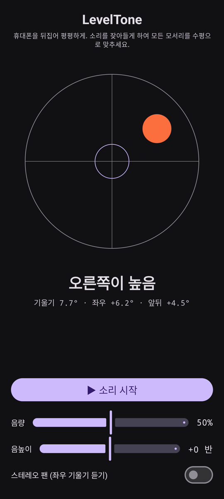

# LevelTone

🌐 언어: [English](README.md) · [Nederlands](README.nl.md) · [Deutsch](README.de.md) · [Français](README.fr.md) · [Español](README.es.md) · [Português](README.pt.md) · [Italiano](README.it.md) · [Polski](README.pl.md) · [Русский](README.ru.md) · [Українська](README.uk.md) · [Türkçe](README.tr.md) · [Svenska](README.sv.md) · [Dansk](README.da.md) · [Norsk](README.nb.md) · [Suomi](README.fi.md) · [Čeština](README.cs.md) · [Ελληνικά](README.el.md) · [Română](README.ro.md) · [Magyar](README.hu.md) · [日本語](README.ja.md) · **한국어** · [简体中文](README.zh-cn.md) · [繁體中文](README.zh-tw.md) · [العربية](README.ar.md) · [עברית](README.he.md) · [हिन्दी](README.hi.md) · [ไทย](README.th.md) · [Tiếng Việt](README.vi.md) · [Bahasa Indonesia](README.id.md) · [فارسی](README.fa.md)

> ⚠️ 🌐 *이 번역은 기계 번역이며 원어민 검수를 거치지 않았습니다. 오류를 발견하셨나요? 수정은 환영합니다 — [PR](../../pulls)을 열어 주세요.*

Android용 **소리로 확인하는 수평계**. 휴대폰을 뒤집어 평평하게 두고 수평 맞추기는
귀에 맡기세요. 연속되는 합성음이 표면이 얼마나 기울었는지 알려주고, 종소리 **핑**이 네 모서리가
모두 수평이 되는 순간을 확인해 줍니다.

## 데모 (30초)

**[▶ 30초 데모 보기](https://github.com/youforge-max/LevelTone/raw/main/docs/LevelTone-demo-ko.mp4)** — 휴대폰이 기울면 기포가 높은 가장자리로
흐르고, 수평이 되면 대상 위에 초록색으로 중앙에 자리 잡습니다.

> ⚠️ **데모에는 소리가 없습니다.** Android 화면 녹화는 앱이 생성한 소리를 담을 수 없어 영상은
> 무음입니다. 실제 휴대폰에서는 음이 안정된 높이까지 오르고 수평에서 종 **핑**이 울리는 것을
> *들을 수 있습니다* — 그것이 이 앱의 핵심입니다.

## 작동 방식

- **연속음** — 수평에서 멀수록 → 낮은 음높이에 빠른 떨림; 가까워질수록 음높이가 오르고 떨림이
  느려짐; **정확히 수평 → 높고 안정된 음** (1318 Hz).
- **수평 핑** — 수평에 들어설 때마다 잦아드는 종소리가 울려 화면을 볼 필요조차 없습니다.
- **방향 표시** — 화면의 수평계와 라벨(`위쪽 가장자리 높음`, `왼쪽이 높음`, … → `수평`).
- **음량 슬라이더**, **음높이 조절** 슬라이더(±1 옥타브), 기울기에 따라 음을 좌우로 옮기는
  **선택적 스테레오 팬**.

완전 오프라인 — 네트워크 없음, 모션 센서 외 권한 없음.

## 설치 (사이드로드)

LevelTone은 **Play 스토어에 없습니다** — 사이드로드로 설치합니다:

1. [최신 릴리스](../../releases/latest)에서 **`LevelTone.apk`**를 다운로드하세요.
2. 파일을 여세요. Android가 경고하면 **설정 → 이 출처 허용**을 누르고 **설치**를 확인하세요.
3. 앱을 여세요.

## 알아두면 좋은 점

- **무료** — 비용 없음, 계정 없음.
- **광고 없음** — 절대 없음. 추적기 없음, 네트워크 없음.
- **지원 없음** — 취미 앱으로 있는 그대로 제공되며 지원이나 업데이트를 보장하지 않습니다. 그래도
  **버그 신고와 풀 리퀘스트는 환영합니다** — [이슈](../../issues)나 [PR](../../pulls)을 열어 주세요.

---

📘 Manual / 手册 / دليل: [English](MANUAL.md) · [Nederlands](MANUAL.nl.md) · [Deutsch](MANUAL.de.md) · [Français](MANUAL.fr.md) · [Español](MANUAL.es.md) · [Português](MANUAL.pt.md) · [Italiano](MANUAL.it.md) · [Polski](MANUAL.pl.md) · [Русский](MANUAL.ru.md) · [Українська](MANUAL.uk.md) · [Türkçe](MANUAL.tr.md) · [Svenska](MANUAL.sv.md) · [Dansk](MANUAL.da.md) · [Norsk](MANUAL.nb.md) · [Suomi](MANUAL.fi.md) · [Čeština](MANUAL.cs.md) · [Ελληνικά](MANUAL.el.md) · [Română](MANUAL.ro.md) · [Magyar](MANUAL.hu.md) · [日本語](MANUAL.ja.md) · [한국어](MANUAL.ko.md) · [简体中文](MANUAL.zh-cn.md) · [繁體中文](MANUAL.zh-tw.md) · [العربية](MANUAL.ar.md) · [עברית](MANUAL.he.md) · [हिन्दी](MANUAL.hi.md) · [ไทย](MANUAL.th.md) · [Tiếng Việt](MANUAL.vi.md) · [Bahasa Indonesia](MANUAL.id.md) · [فارسی](MANUAL.fa.md)  
🔧 Build instructions, tilt math & license: see the [English README](README.md).

