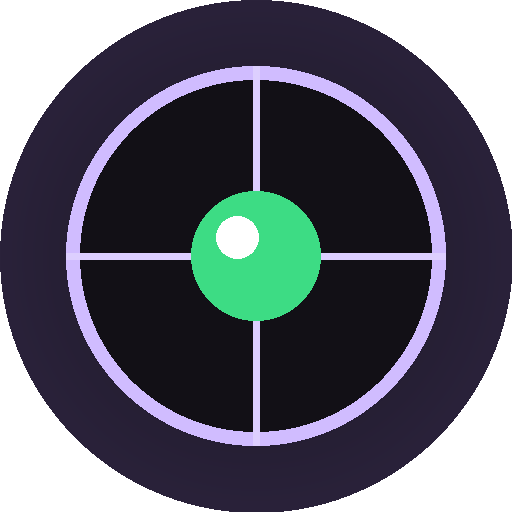
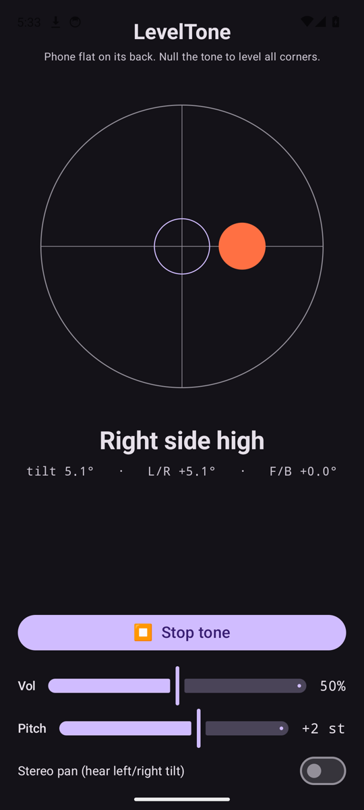

# LevelTone

> Audio spirit-level for Android — tone tracks tilt, bell pings when level. Kotlin/Compose, offline.

🌐 Languages: **English** · [Nederlands](README.nl.md) · [Deutsch](README.de.md) · [Français](README.fr.md) · [Español](README.es.md) · [Português](README.pt.md) · [Italiano](README.it.md) · [Polski](README.pl.md) · [Русский](README.ru.md) · [Українська](README.uk.md) · [Türkçe](README.tr.md) · [Svenska](README.sv.md) · [Dansk](README.da.md) · [Norsk](README.nb.md) · [Suomi](README.fi.md) · [Čeština](README.cs.md) · [Ελληνικά](README.el.md) · [Română](README.ro.md) · [Magyar](README.hu.md) · [日本語](README.ja.md) · [한국어](README.ko.md) · [简体中文](README.zh-cn.md) · [繁體中文](README.zh-tw.md) · [العربية](README.ar.md) · [עברית](README.he.md) · [हिन्दी](README.hi.md) · [ไทย](README.th.md) · [Tiếng Việt](README.vi.md) · [Bahasa Indonesia](README.id.md) · [فارسی](README.fa.md)

An **audio spirit-level** for Android. Lay your phone flat on its back and let your
ears do the leveling: a continuous synth tone tracks how far off level the surface is,
and a bell **ping** confirms the moment all four corners are level.

<p align="center">
  
</p>

## Demo (30 s)

<a href="https://github.com/youforge-max/LevelTone/raw/main/docs/LevelTone-demo.mp4"></a>

**[▶ Watch the 30-second demo](https://github.com/youforge-max/LevelTone/raw/main/docs/LevelTone-demo.mp4)** —
the phone tilts, the bubble drifts to the high edge, then settles green-centered on the
target as it comes level.

> ⚠️ **The demo has no audio.** Android screen recording can't capture an app's generated
> sound, so the video is silent. On a real phone you'd *hear* the tone rise to a steady
> pitch and the bell **ping** at level — that's the whole point of the app. See
> [How it works](#how-it-works) for what you'd be hearing.

## How it works

- **Continuous tone** — far off level → low pitch with a fast amplitude wobble;
  as you approach level the pitch rises and the wobble slows; **dead level → a high,
  steady tone** (1318 Hz).
- **Level ping** — a decaying bell chime fires every time you cross into level, so you
  don't even need to watch the screen.
- **Direction readout** — an on-screen bubble level plus a label (`Top edge high`,
  `Left side high`, … → `LEVEL`) tells you which way it's tilting.
- **Volume slider**, an **adjustable pitch** slider (transpose the whole tone up to ±1
  octave to a range that's easy on your ears), and an **optional stereo-pan** switch
  (off by default) that pans the tone left/right with the tilt.

Fully offline — no network, no permissions beyond the motion sensor.

## Install (sideload)

LevelTone is **not on the Play Store** — you sideload it:

1. Download **`LevelTone.apk`** from the [latest release](../../releases/latest).
2. Open the file. If Android warns, tap **Settings → Allow from this source**, then
   confirm **Install**.
3. Open the app.

See the **[User Manual](MANUAL.md)** for how to level something by ear.

## Good to know

- **Free** — no cost, no accounts.
- **Ad-free** — no ads, ever. No trackers, no network.
- **No support** — this is a hobby app provided as-is, with no guarantee of support or
  updates. That said, **bug reports and pull requests are welcome** — open an
  [issue](../../issues) or a [PR](../../pulls).

## Build

```bash
export ANDROID_HOME=~/android-sdk
./gradlew :app:assembleDebug
# -> app/build/outputs/apk/debug/app-debug.apk
```

- Kotlin + Jetpack Compose (Material 3, dark)
- `SensorManager` `TYPE_GRAVITY` (falls back to a low-pass–filtered accelerometer)
- Streaming `AudioTrack` sine synth with click-free one-pole smoothing
- minSdk 24 · compileSdk 35 · package `eu.cisodiagonal.leveltone`

## Tilt math

Screen-normal tilt = `acos(gz / |g|)` (0° = flat). Roll `atan2(gx, gz)` and pitch
`atan2(gy, gz)` give the left/right and front/back components that drive the bubble and
the direction label.

## License

MIT
