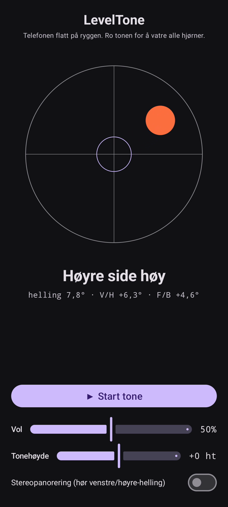

# LevelTone

🌐 Språk: [English](README.md) · [Nederlands](README.nl.md) · [Deutsch](README.de.md) · [Français](README.fr.md) · [Español](README.es.md) · [Português](README.pt.md) · [Italiano](README.it.md) · [Polski](README.pl.md) · [Русский](README.ru.md) · [Українська](README.uk.md) · [Türkçe](README.tr.md) · [Svenska](README.sv.md) · [Dansk](README.da.md) · **Norsk** · [Suomi](README.fi.md) · [Čeština](README.cs.md) · [Ελληνικά](README.el.md) · [Română](README.ro.md) · [Magyar](README.hu.md) · [日本語](README.ja.md) · [한국어](README.ko.md) · [简体中文](README.zh-cn.md) · [繁體中文](README.zh-tw.md) · [العربية](README.ar.md) · [עברית](README.he.md) · [हिन्दी](README.hi.md) · [ไทย](README.th.md) · [Tiếng Việt](README.vi.md) · [Bahasa Indonesia](README.id.md) · [فارسی](README.fa.md)

> ⚠️ 🌐 *Denne oversettelsen er maskinassistert og ikke gjennomgått av en morsmålsbruker. Sett en feil? Rettelser er velkomne — åpne en [PR](../../pulls).*

Et **hørbart vater** for Android. Legg telefonen flatt på ryggen, og la ørene ta
nivelleringen: en kontinuerlig synthtone viser hvor mye overflaten heller, og et klokke-**pip**
bekrefter øyeblikket når alle fire hjørner er i vater.

## Demo (30 s)

**[▶ Se demoen på 30 sekunder](https://github.com/youforge-max/LevelTone/raw/main/docs/LevelTone-demo-nb.mp4)** — telefonen heller, boblen
driver mot den høye kanten og legger seg deretter grønn-sentrert på målet når den blir i vater.

> ⚠️ **Demoen har ingen lyd.** Androids skjermopptak kan ikke fange en apps genererte lyd, så
> videoen er stum. På en ekte telefon ville du *høre* tonen stige til en stabil tonehøyde og
> klokke-**pipet** ved vater — det er hele poenget med appen.

## Slik fungerer det

- **Kontinuerlig tone** — langt fra vater → lav tonehøyde med rask vibrato; nærmere vater
  stiger tonehøyden og vibratoen roer seg; **nøyaktig i vater → en høy, stabil tone** (1318 Hz).
- **Vater-pip** — en avtagende klokkeklang høres hver gang du treffer vater, så du trenger ikke
  engang å se på skjermen.
- **Retningsvisning** — et vater på skjermen pluss en etikett
  (`Øvre kant høy`, `Venstre side høy`, … → `I VATER`).
- **Volumglidebryter**, en glidebryter for **justerbar tonehøyde** (±1 oktav) og en **valgfri
  stereopanorering** som flytter tonen venstre/høyre med hellingen.

Helt frakoblet — ingen nettverk, ingen tillatelser utover bevegelsessensoren.

## Installer (sideload)

LevelTone er **ikke på Play Store** — du sidelaster det:

1. Last ned **`LevelTone.apk`** fra [siste utgivelse](../../releases/latest).
2. Åpne filen. Hvis Android advarer, trykk **Innstillinger → Tillat fra denne kilden**, og
   bekreft **Installer**.
3. Åpne appen.

## Greit å vite

- **Gratis** — ingen kostnad, ingen kontoer.
- **Reklamefri** — aldri. Ingen sporere, ingen nettverk.
- **Ingen støtte** — hobbyapp, som den er, uten garanti for støtte eller oppdateringer.
  Likevel er **feilrapporter og pull requests velkomne** — åpne en [issue](../../issues)
  eller [PR](../../pulls).

---

📘 Manual / 手册 / دليل: [English](MANUAL.md) · [Nederlands](MANUAL.nl.md) · [Deutsch](MANUAL.de.md) · [Français](MANUAL.fr.md) · [Español](MANUAL.es.md) · [Português](MANUAL.pt.md) · [Italiano](MANUAL.it.md) · [Polski](MANUAL.pl.md) · [Русский](MANUAL.ru.md) · [Українська](MANUAL.uk.md) · [Türkçe](MANUAL.tr.md) · [Svenska](MANUAL.sv.md) · [Dansk](MANUAL.da.md) · [Norsk](MANUAL.nb.md) · [Suomi](MANUAL.fi.md) · [Čeština](MANUAL.cs.md) · [Ελληνικά](MANUAL.el.md) · [Română](MANUAL.ro.md) · [Magyar](MANUAL.hu.md) · [日本語](MANUAL.ja.md) · [한국어](MANUAL.ko.md) · [简体中文](MANUAL.zh-cn.md) · [繁體中文](MANUAL.zh-tw.md) · [العربية](MANUAL.ar.md) · [עברית](MANUAL.he.md) · [हिन्दी](MANUAL.hi.md) · [ไทย](MANUAL.th.md) · [Tiếng Việt](MANUAL.vi.md) · [Bahasa Indonesia](MANUAL.id.md) · [فارسی](MANUAL.fa.md)  
🔧 Build instructions, tilt math & license: see the [English README](README.md).

