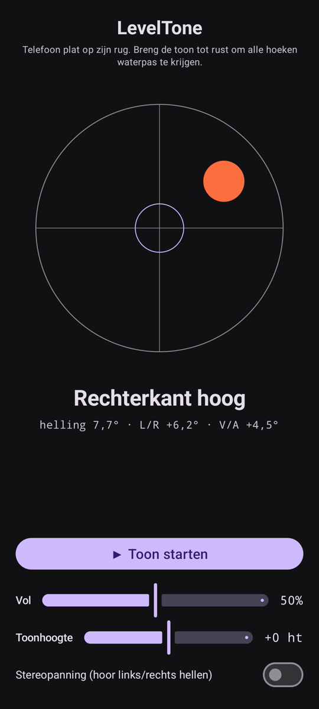

# LevelTone

🌐 Talen: [English](README.md) · **Nederlands** · [Deutsch](README.de.md) · [Français](README.fr.md) · [Español](README.es.md) · [Português](README.pt.md) · [Italiano](README.it.md) · [Polski](README.pl.md) · [Русский](README.ru.md) · [Українська](README.uk.md) · [Türkçe](README.tr.md) · [Svenska](README.sv.md) · [Dansk](README.da.md) · [Norsk](README.nb.md) · [Suomi](README.fi.md) · [Čeština](README.cs.md) · [Ελληνικά](README.el.md) · [Română](README.ro.md) · [Magyar](README.hu.md) · [日本語](README.ja.md) · [한국어](README.ko.md) · [简体中文](README.zh-cn.md) · [繁體中文](README.zh-tw.md) · [العربية](README.ar.md) · [עברית](README.he.md) · [हिन्दी](README.hi.md) · [ไทย](README.th.md) · [Tiếng Việt](README.vi.md) · [Bahasa Indonesia](README.id.md) · [فارسی](README.fa.md)

> ⚠️ 🌐 *Deze vertaling is machinaal gemaakt en niet door een moedertaalspreker nagekeken. Fout gezien? Verbeteringen zijn welkom — open een [PR](../../pulls).*

Een **audio-waterpas** voor Android. Leg je telefoon plat op zijn rug en laat je
oren het waterpas stellen doen: een doorlopende synthtoon volgt hoever het oppervlak
uit het lood staat, en een bel-**ping** bevestigt het moment dat alle vier de hoeken
waterpas zijn.

<p align="center">
  
</p>

## Demo (30 s)

<a href="https://github.com/youforge-max/LevelTone/raw/main/docs/LevelTone-demo-nl.mp4"></a>

**[▶ Bekijk de demo van 30 seconden](https://github.com/youforge-max/LevelTone/raw/main/docs/LevelTone-demo-nl.mp4)** —
de telefoon kantelt, de bel drijft naar de hoge rand en komt dan groen-gecentreerd op
het doel tot rust zodra hij waterpas raakt.

> ⚠️ **De demo heeft geen geluid.** Schermopname op Android kan het gegenereerde geluid
> van een app niet vastleggen, dus de video is stil. Op een echte telefoon zou je de toon
> *horen* stijgen tot een stabiele toonhoogte en de bel horen **pingen** bij waterpas —
> dat is de hele bedoeling van de app. Zie [Hoe het werkt](#hoe-het-werkt) voor wat je zou horen.

## Hoe het werkt

- **Doorlopende toon** — ver uit het lood → lage toonhoogte met een snelle amplitude-trilling;
  naarmate je dichter bij waterpas komt stijgt de toonhoogte en vertraagt de trilling;
  **precies waterpas → een hoge, stabiele toon** (1318 Hz).
- **Waterpas-ping** — een uitstervend belgeluid klinkt telkens wanneer je waterpas raakt,
  zodat je niet eens naar het scherm hoeft te kijken.
- **Richtingsaanwijzing** — een waterpas op het scherm plus een label (`Bovenrand hoog`,
  `Linkerkant hoog`, … → `WATERPAS`) vertelt welke kant op hij helt.
- **Volumeschuif**, een **verstelbare toonhoogte**-schuif (transponeer de hele toon tot
  ±1 octaaf naar een bereik dat prettig is voor je oren) en een **optionele stereopanning**-
  schakelaar (standaard uit) die de toon links/rechts pant met de helling.

Volledig offline — geen netwerk, geen rechten behalve de bewegingssensor.

## Installeren (sideloaden)

LevelTone staat **niet in de Play Store** — je sideloadt het:

1. Download **`LevelTone.apk`** van de [laatste release](../../releases/latest).
2. Open het bestand. Als Android waarschuwt, tik op **Instellingen → Toestaan van deze bron**
   en bevestig daarna **Installeren**.
3. Open de app.

Zie de **[Handleiding](MANUAL.nl.md)** voor hoe je iets op het gehoor waterpas stelt.

## Goed om te weten

- **Gratis** — geen kosten, geen accounts.
- **Reclamevrij** — nooit reclame. Geen trackers, geen netwerk.
- **Geen ondersteuning** — dit is een hobbyapp, geleverd as-is, zonder garantie op
  ondersteuning of updates. Toch zijn **bugmeldingen en pull requests welkom** — open een
  [issue](../../issues) of een [PR](../../pulls).

## Bouwen

```bash
export ANDROID_HOME=~/android-sdk
./gradlew :app:assembleDebug
# -> app/build/outputs/apk/debug/app-debug.apk
```

- Kotlin + Jetpack Compose (Material 3, donker)
- `SensorManager` `TYPE_GRAVITY` (valt terug op een laagdoorlaat-gefilterde accelerometer)
- Streaming `AudioTrack` sinus-synth met klikvrije one-pole smoothing
- minSdk 24 · compileSdk 35 · pakket `eu.cisodiagonal.leveltone`

## Kantelwiskunde

Schermnormaal-kanteling = `acos(gz / |g|)` (0° = plat). Rol `atan2(gx, gz)` en pitch
`atan2(gy, gz)` geven de links/rechts- en voor/achter-componenten die de bel en het
richtingslabel aansturen.

## Licentie

MIT
