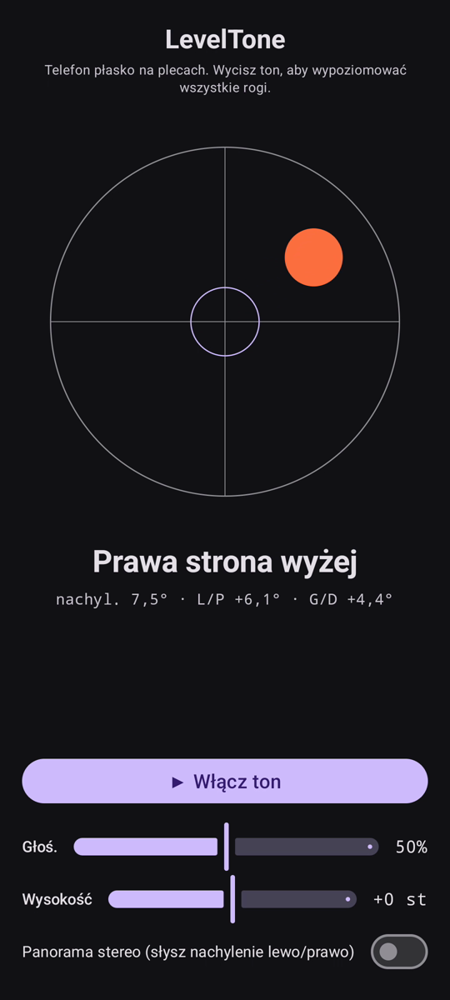

# LevelTone

🌐 Języki: [English](README.md) · [Nederlands](README.nl.md) · [Deutsch](README.de.md) · [Français](README.fr.md) · [Español](README.es.md) · [Português](README.pt.md) · [Italiano](README.it.md) · **Polski** · [Русский](README.ru.md) · [Українська](README.uk.md) · [Türkçe](README.tr.md) · [Svenska](README.sv.md) · [Dansk](README.da.md) · [Norsk](README.nb.md) · [Suomi](README.fi.md) · [Čeština](README.cs.md) · [Ελληνικά](README.el.md) · [Română](README.ro.md) · [Magyar](README.hu.md) · [日本語](README.ja.md) · [한국어](README.ko.md) · [简体中文](README.zh-cn.md) · [繁體中文](README.zh-tw.md) · [العربية](README.ar.md) · [עברית](README.he.md) · [हिन्दी](README.hi.md) · [ไทย](README.th.md) · [Tiếng Việt](README.vi.md) · [Bahasa Indonesia](README.id.md) · [فارسی](README.fa.md)

> ⚠️ 🌐 *To tłumaczenie zostało wykonane maszynowo i nie było sprawdzane przez rodzimego użytkownika. Widzisz błąd? Poprawki są mile widziane — otwórz [PR](../../pulls).*

**Dźwiękowa poziomica** na Androida. Połóż telefon płasko na plecach i pozwól, by
poziomowały twoje uszy: ciągły ton syntezatora pokazuje, jak bardzo powierzchnia jest poza
poziomem, a **bip** dzwonka potwierdza moment, gdy wszystkie cztery rogi są w poziomie.

## Demonstracja (30 s)

**[▶ Obejrzyj 30-sekundowe demo](https://github.com/youforge-max/LevelTone/raw/main/docs/LevelTone-demo-pl.mp4)** — telefon się przechyla,
bąbelek dryfuje do wysokiej krawędzi, a potem stabilizuje się na zielono wyśrodkowany na celu,
gdy osiąga poziom.

> ⚠️ **Demo nie ma dźwięku.** Nagrywanie ekranu Androida nie potrafi uchwycić dźwięku
> generowanego przez aplikację, więc film jest niemy. Na prawdziwym telefonie *usłyszałbyś*
> ton wznoszący się do stabilnej wysokości i **bip** dzwonka na poziomie — o to właśnie chodzi.

## Jak to działa

- **Ciągły ton** — daleko od poziomu → niska wysokość z szybkim drganiem; w miarę zbliżania się
  do poziomu wysokość rośnie, a drganie zwalnia; **idealny poziom → wysoki, stabilny ton**
  (1318 Hz).
- **Bip poziomu** — zanikający dźwięk dzwonka rozbrzmiewa za każdym razem, gdy osiągasz poziom,
  więc nie musisz nawet patrzeć na ekran.
- **Wskazanie kierunku** — poziomica na ekranie plus etykieta
  (`Górna krawędź wyżej`, `Lewa strona wyżej`, … → `POZIOMO`).
- **Suwak głośności**, suwak **regulowanej wysokości** (±1 oktawa) oraz **opcjonalna panorama
  stereo** przesuwająca ton w lewo/prawo wraz z przechyleniem.

Całkowicie offline — bez sieci, bez uprawnień poza czujnikiem ruchu.

## Instalacja (sideload)

LevelTone **nie ma go w Sklepie Play** — instalujesz przez sideload:

1. Pobierz **`LevelTone.apk`** z [najnowszego wydania](../../releases/latest).
2. Otwórz plik. Jeśli Android ostrzega, dotknij **Ustawienia → Zezwól z tego źródła** i
   potwierdź **Zainstaluj**.
3. Otwórz aplikację.

## Warto wiedzieć

- **Za darmo** — bez opłat, bez kont.
- **Bez reklam** — nigdy. Bez trackerów, bez sieci.
- **Bez wsparcia** — aplikacja hobbystyczna, taka jaka jest, bez gwarancji wsparcia ani
  aktualizacji. Mimo to **zgłoszenia błędów i pull requesty są mile widziane** — otwórz
  [issue](../../issues) lub [PR](../../pulls).

---

📘 Manual / 手册 / دليل: [English](MANUAL.md) · [Nederlands](MANUAL.nl.md) · [Deutsch](MANUAL.de.md) · [Français](MANUAL.fr.md) · [Español](MANUAL.es.md) · [Português](MANUAL.pt.md) · [Italiano](MANUAL.it.md) · [Polski](MANUAL.pl.md) · [Русский](MANUAL.ru.md) · [Українська](MANUAL.uk.md) · [Türkçe](MANUAL.tr.md) · [Svenska](MANUAL.sv.md) · [Dansk](MANUAL.da.md) · [Norsk](MANUAL.nb.md) · [Suomi](MANUAL.fi.md) · [Čeština](MANUAL.cs.md) · [Ελληνικά](MANUAL.el.md) · [Română](MANUAL.ro.md) · [Magyar](MANUAL.hu.md) · [日本語](MANUAL.ja.md) · [한국어](MANUAL.ko.md) · [简体中文](MANUAL.zh-cn.md) · [繁體中文](MANUAL.zh-tw.md) · [العربية](MANUAL.ar.md) · [עברית](MANUAL.he.md) · [हिन्दी](MANUAL.hi.md) · [ไทย](MANUAL.th.md) · [Tiếng Việt](MANUAL.vi.md) · [Bahasa Indonesia](MANUAL.id.md) · [فارسی](MANUAL.fa.md)  
🔧 Build instructions, tilt math & license: see the [English README](README.md).

