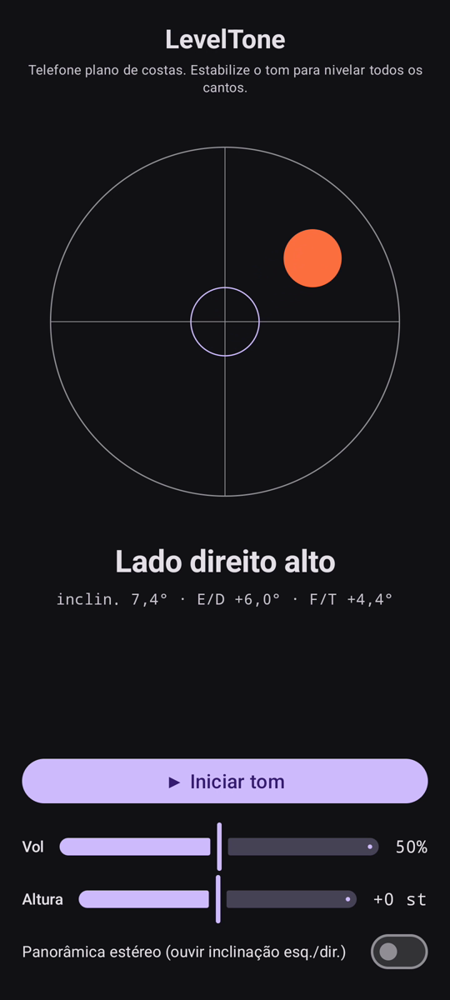

# LevelTone

🌐 Idiomas: [English](README.md) · [Nederlands](README.nl.md) · [Deutsch](README.de.md) · [Français](README.fr.md) · [Español](README.es.md) · **Português** · [Italiano](README.it.md) · [Polski](README.pl.md) · [Русский](README.ru.md) · [Українська](README.uk.md) · [Türkçe](README.tr.md) · [Svenska](README.sv.md) · [Dansk](README.da.md) · [Norsk](README.nb.md) · [Suomi](README.fi.md) · [Čeština](README.cs.md) · [Ελληνικά](README.el.md) · [Română](README.ro.md) · [Magyar](README.hu.md) · [日本語](README.ja.md) · [한국어](README.ko.md) · [简体中文](README.zh-cn.md) · [繁體中文](README.zh-tw.md) · [العربية](README.ar.md) · [עברית](README.he.md) · [हिन्दी](README.hi.md) · [ไทย](README.th.md) · [Tiếng Việt](README.vi.md) · [Bahasa Indonesia](README.id.md) · [فارسی](README.fa.md)

> ⚠️ 🌐 *Esta tradução é assistida por máquina e não foi revisada por um falante nativo. Viu um erro? Correções são bem-vindas — abra um [PR](../../pulls).*

Um **nível de bolha sonoro** para Android. Apoie o telefone plano de costas e deixe
seus ouvidos fazerem o nivelamento: um tom sintetizado contínuo mostra o quanto a superfície
está fora de nível, e um **bip** de sino confirma o momento em que os quatro cantos ficam
nivelados.

## Demonstração (30 s)

**[▶ Assistir à demonstração de 30 segundos](https://github.com/youforge-max/LevelTone/raw/main/docs/LevelTone-demo-pt.mp4)** — o telefone
inclina, a bolha desliza para a borda alta e depois se estabiliza centralizada em verde no
alvo ao ficar nivelado.

> ⚠️ **A demonstração não tem áudio.** A gravação de tela do Android não capta o som gerado
> por um app, então o vídeo é mudo. Num telefone real você *ouviria* o tom subir até uma
> altura estável e o **bip** de sino ao nivelar — é todo o propósito do app.

## Como funciona

- **Tom contínuo** — muito fora de nível → altura baixa com oscilação rápida; ao se aproximar
  do nível a altura sobe e a oscilação desacelera; **perfeitamente nivelado → um tom agudo e
  estável** (1318 Hz).
- **Bip de nível** — um sino que decai toca sempre que você cruza para o nível, então nem
  precisa olhar a tela.
- **Indicação de direção** — um nível de bolha na tela mais um rótulo
  (`Borda superior alta`, `Lado esquerdo alto`, … → `NIVELADO`).
- **Controle de volume**, um controle de **altura ajustável** (±1 oitava) e um **panorama
  estéreo opcional** que desloca o tom para a esquerda/direita com a inclinação.

Totalmente offline — sem rede, sem permissões além do sensor de movimento.

## Instalar (sideload)

O LevelTone **não está na Play Store** — instale por sideload:

1. Baixe **`LevelTone.apk`** da [versão mais recente](../../releases/latest).
2. Abra o arquivo. Se o Android avisar, toque em **Configurações → Permitir desta fonte** e
   confirme **Instalar**.
3. Abra o app.

## Bom saber

- **Grátis** — sem custo nem contas.
- **Sem anúncios** — nunca. Sem rastreadores, sem rede.
- **Sem suporte** — app de hobby, no estado em que se encontra, sem garantia de suporte ou
  atualizações. Ainda assim, **relatórios de bugs e pull requests são bem-vindos** — abra uma
  [issue](../../issues) ou um [PR](../../pulls).

---

📘 Manual / 手册 / دليل: [English](MANUAL.md) · [Nederlands](MANUAL.nl.md) · [Deutsch](MANUAL.de.md) · [Français](MANUAL.fr.md) · [Español](MANUAL.es.md) · [Português](MANUAL.pt.md) · [Italiano](MANUAL.it.md) · [Polski](MANUAL.pl.md) · [Русский](MANUAL.ru.md) · [Українська](MANUAL.uk.md) · [Türkçe](MANUAL.tr.md) · [Svenska](MANUAL.sv.md) · [Dansk](MANUAL.da.md) · [Norsk](MANUAL.nb.md) · [Suomi](MANUAL.fi.md) · [Čeština](MANUAL.cs.md) · [Ελληνικά](MANUAL.el.md) · [Română](MANUAL.ro.md) · [Magyar](MANUAL.hu.md) · [日本語](MANUAL.ja.md) · [한국어](MANUAL.ko.md) · [简体中文](MANUAL.zh-cn.md) · [繁體中文](MANUAL.zh-tw.md) · [العربية](MANUAL.ar.md) · [עברית](MANUAL.he.md) · [हिन्दी](MANUAL.hi.md) · [ไทย](MANUAL.th.md) · [Tiếng Việt](MANUAL.vi.md) · [Bahasa Indonesia](MANUAL.id.md) · [فارسی](MANUAL.fa.md)  
🔧 Build instructions, tilt math & license: see the [English README](README.md).

