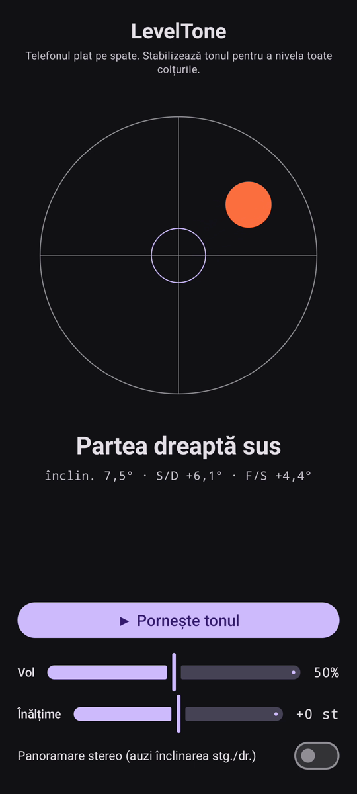

# LevelTone

🌐 Limbi: [English](README.md) · [Nederlands](README.nl.md) · [Deutsch](README.de.md) · [Français](README.fr.md) · [Español](README.es.md) · [Português](README.pt.md) · [Italiano](README.it.md) · [Polski](README.pl.md) · [Русский](README.ru.md) · [Українська](README.uk.md) · [Türkçe](README.tr.md) · [Svenska](README.sv.md) · [Dansk](README.da.md) · [Norsk](README.nb.md) · [Suomi](README.fi.md) · [Čeština](README.cs.md) · [Ελληνικά](README.el.md) · **Română** · [Magyar](README.hu.md) · [日本語](README.ja.md) · [한국어](README.ko.md) · [简体中文](README.zh-cn.md) · [繁體中文](README.zh-tw.md) · [العربية](README.ar.md) · [עברית](README.he.md) · [हिन्दी](README.hi.md) · [ไทย](README.th.md) · [Tiếng Việt](README.vi.md) · [Bahasa Indonesia](README.id.md) · [فارسی](README.fa.md)

> ⚠️ 🌐 *Această traducere este asistată de mașină și nu a fost revizuită de un vorbitor nativ. Ai văzut o greșeală? Corecțiile sunt binevenite — deschide un [PR](../../pulls).*

O **nivelă cu bulă sonoră** pentru Android. Așază telefonul plat pe spate și lasă
urechile să facă nivelarea: un ton de sinteză continuu arată cât de mult este suprafața în
afara nivelului, iar un **bip** de clopoțel confirmă momentul în care toate cele patru colțuri
sunt la nivel.

## Demonstrație (30 s)

**[▶ Vezi demonstrația de 30 de secunde](https://github.com/youforge-max/LevelTone/raw/main/docs/LevelTone-demo-ro.mp4)** — telefonul se
înclină, bula se deplasează spre marginea înaltă, apoi se stabilizează verde-centrată pe țintă
când ajunge la nivel.

> ⚠️ **Demonstrația nu are sunet.** Înregistrarea ecranului Android nu poate capta sunetul
> generat de o aplicație, așa că videoclipul este mut. Pe un telefon real ai *auzi* tonul urcând
> până la o înălțime stabilă și **bipul** de clopoțel la nivel — acesta este tot rostul aplicației.

## Cum funcționează

- **Ton continuu** — mult în afara nivelului → înălțime joasă cu oscilație rapidă; pe măsură ce
  te apropii, înălțimea urcă și oscilația încetinește; **exact la nivel → un ton înalt și stabil**
  (1318 Hz).
- **Bip de nivel** — un dangăt de clopoțel care se stinge sună de fiecare dată când ajungi la
  nivel, așa că nici nu trebuie să te uiți la ecran.
- **Indicație de direcție** — o nivelă cu bulă pe ecran plus o etichetă
  (`Marginea de sus sus`, `Partea stângă sus`, … → `LA NIVEL`).
- **Cursor de volum**, un cursor de **înălțime reglabilă** (±1 octavă) și o **panoramare stereo
  opțională** care mută tonul stânga/dreapta odată cu înclinarea.

Complet offline — fără rețea, fără permisiuni în afara senzorului de mișcare.

## Instalare (sideload)

LevelTone **nu este pe Play Store** — se instalează prin sideload:

1. Descarcă **`LevelTone.apk`** din [cea mai recentă versiune](../../releases/latest).
2. Deschide fișierul. Dacă Android avertizează, atinge **Setări → Permite din această sursă** și
   confirmă **Instalează**.
3. Deschide aplicația.

## Bine de știut

- **Gratuit** — fără cost, fără conturi.
- **Fără reclame** — niciodată. Fără urmăritori, fără rețea.
- **Fără asistență** — aplicație de hobby, ca atare, fără garanție de asistență sau actualizări.
  Totuși, **rapoartele de erori și pull request-urile sunt binevenite** — deschide o
  [issue](../../issues) sau un [PR](../../pulls).

---

📘 Manual / 手册 / دليل: [English](MANUAL.md) · [Nederlands](MANUAL.nl.md) · [Deutsch](MANUAL.de.md) · [Français](MANUAL.fr.md) · [Español](MANUAL.es.md) · [Português](MANUAL.pt.md) · [Italiano](MANUAL.it.md) · [Polski](MANUAL.pl.md) · [Русский](MANUAL.ru.md) · [Українська](MANUAL.uk.md) · [Türkçe](MANUAL.tr.md) · [Svenska](MANUAL.sv.md) · [Dansk](MANUAL.da.md) · [Norsk](MANUAL.nb.md) · [Suomi](MANUAL.fi.md) · [Čeština](MANUAL.cs.md) · [Ελληνικά](MANUAL.el.md) · [Română](MANUAL.ro.md) · [Magyar](MANUAL.hu.md) · [日本語](MANUAL.ja.md) · [한국어](MANUAL.ko.md) · [简体中文](MANUAL.zh-cn.md) · [繁體中文](MANUAL.zh-tw.md) · [العربية](MANUAL.ar.md) · [עברית](MANUAL.he.md) · [हिन्दी](MANUAL.hi.md) · [ไทย](MANUAL.th.md) · [Tiếng Việt](MANUAL.vi.md) · [Bahasa Indonesia](MANUAL.id.md) · [فارسی](MANUAL.fa.md)  
🔧 Build instructions, tilt math & license: see the [English README](README.md).

