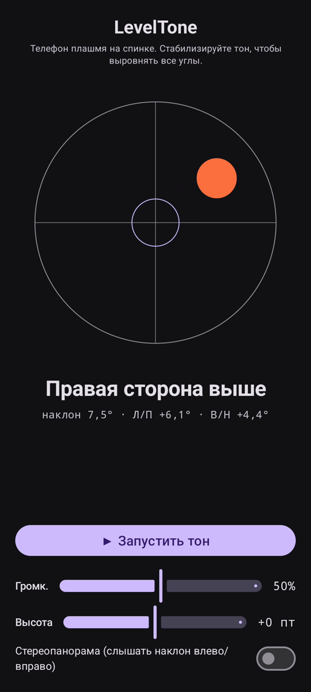

# LevelTone

🌐 Языки: [English](README.md) · [Nederlands](README.nl.md) · [Deutsch](README.de.md) · [Français](README.fr.md) · [Español](README.es.md) · [Português](README.pt.md) · [Italiano](README.it.md) · [Polski](README.pl.md) · **Русский** · [Українська](README.uk.md) · [Türkçe](README.tr.md) · [Svenska](README.sv.md) · [Dansk](README.da.md) · [Norsk](README.nb.md) · [Suomi](README.fi.md) · [Čeština](README.cs.md) · [Ελληνικά](README.el.md) · [Română](README.ro.md) · [Magyar](README.hu.md) · [日本語](README.ja.md) · [한국어](README.ko.md) · [简体中文](README.zh-cn.md) · [繁體中文](README.zh-tw.md) · [العربية](README.ar.md) · [עברית](README.he.md) · [हिन्दी](README.hi.md) · [ไทย](README.th.md) · [Tiếng Việt](README.vi.md) · [Bahasa Indonesia](README.id.md) · [فارسی](README.fa.md)

> ⚠️ 🌐 *Этот перевод сделан машиной и не проверен носителем языка. Заметили ошибку? Исправления приветствуются — откройте [PR](../../pulls).*

**Звуковой уровень** для Android. Положите телефон плашмя на спинку и позвольте
ушам выполнять выравнивание: непрерывный синтезированный тон показывает, насколько поверхность
отклонена от горизонтали, а **звонок**-сигнал подтверждает момент, когда все четыре угла
выровнены.

## Демонстрация (30 с)

**[▶ Смотреть 30-секундную демонстрацию](https://github.com/youforge-max/LevelTone/raw/main/docs/LevelTone-demo-ru.mp4)** — телефон
наклоняется, пузырёк смещается к высокому краю, затем зелёным останавливается по центру цели,
когда достигает горизонтали.

> ⚠️ **В демонстрации нет звука.** Запись экрана Android не может захватить генерируемый
> приложением звук, поэтому видео беззвучное. На реальном телефоне вы бы *услышали*, как тон
> поднимается до устойчивой высоты, и **звонок** при выравнивании — в этом весь смысл.

## Как это работает

- **Непрерывный тон** — далеко от горизонтали → низкая высота с быстрым дрожанием; по мере
  приближения высота растёт, а дрожание замедляется; **точная горизонталь → высокий, ровный
  тон** (1318 Гц).
- **Сигнал уровня** — затухающий звон раздаётся каждый раз при достижении горизонтали, так что
  на экран можно даже не смотреть.
- **Индикация направления** — уровень с пузырьком на экране плюс метка
  (`Верхний край выше`, `Левая сторона выше`, … → `РОВНО`).
- **Ползунок громкости**, ползунок **регулируемой высоты** (±1 октава) и **необязательная
  стереопанорама**, сдвигающая тон влево/вправо с наклоном.

Полностью офлайн — без сети, без разрешений, кроме датчика движения.

## Установка (sideload)

LevelTone **нет в Play Маркете** — устанавливается через sideload:

1. Скачайте **`LevelTone.apk`** из [последнего релиза](../../releases/latest).
2. Откройте файл. Если Android предупреждает, нажмите **Настройки → Разрешить из этого
   источника** и подтвердите **Установить**.
3. Откройте приложение.

## Полезно знать

- **Бесплатно** — без оплаты и аккаунтов.
- **Без рекламы** — никогда. Без трекеров, без сети.
- **Без поддержки** — любительское приложение, как есть, без гарантии поддержки или обновлений.
  Тем не менее **сообщения об ошибках и pull-запросы приветствуются** — откройте
  [issue](../../issues) или [PR](../../pulls).

---

📘 Manual / 手册 / دليل: [English](MANUAL.md) · [Nederlands](MANUAL.nl.md) · [Deutsch](MANUAL.de.md) · [Français](MANUAL.fr.md) · [Español](MANUAL.es.md) · [Português](MANUAL.pt.md) · [Italiano](MANUAL.it.md) · [Polski](MANUAL.pl.md) · [Русский](MANUAL.ru.md) · [Українська](MANUAL.uk.md) · [Türkçe](MANUAL.tr.md) · [Svenska](MANUAL.sv.md) · [Dansk](MANUAL.da.md) · [Norsk](MANUAL.nb.md) · [Suomi](MANUAL.fi.md) · [Čeština](MANUAL.cs.md) · [Ελληνικά](MANUAL.el.md) · [Română](MANUAL.ro.md) · [Magyar](MANUAL.hu.md) · [日本語](MANUAL.ja.md) · [한국어](MANUAL.ko.md) · [简体中文](MANUAL.zh-cn.md) · [繁體中文](MANUAL.zh-tw.md) · [العربية](MANUAL.ar.md) · [עברית](MANUAL.he.md) · [हिन्दी](MANUAL.hi.md) · [ไทย](MANUAL.th.md) · [Tiếng Việt](MANUAL.vi.md) · [Bahasa Indonesia](MANUAL.id.md) · [فارسی](MANUAL.fa.md)  
🔧 Build instructions, tilt math & license: see the [English README](README.md).

