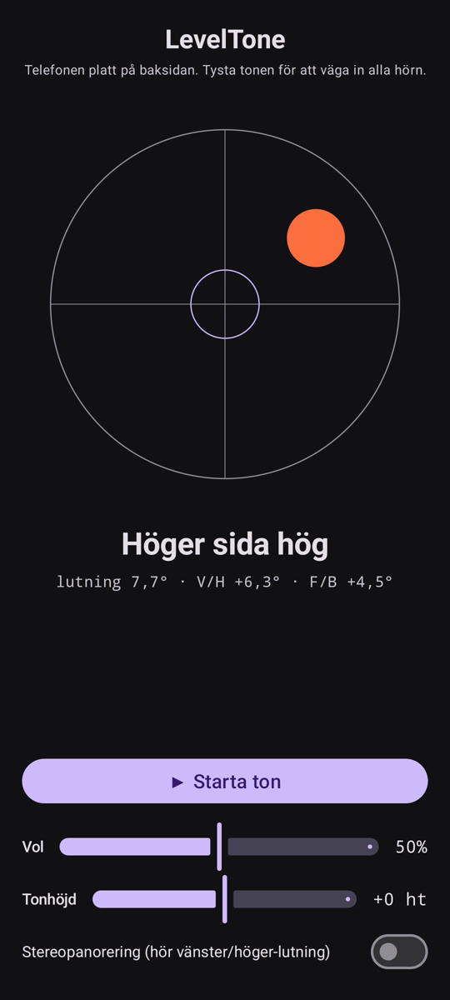

# LevelTone

🌐 Språk: [English](README.md) · [Nederlands](README.nl.md) · [Deutsch](README.de.md) · [Français](README.fr.md) · [Español](README.es.md) · [Português](README.pt.md) · [Italiano](README.it.md) · [Polski](README.pl.md) · [Русский](README.ru.md) · [Українська](README.uk.md) · [Türkçe](README.tr.md) · **Svenska** · [Dansk](README.da.md) · [Norsk](README.nb.md) · [Suomi](README.fi.md) · [Čeština](README.cs.md) · [Ελληνικά](README.el.md) · [Română](README.ro.md) · [Magyar](README.hu.md) · [日本語](README.ja.md) · [한국어](README.ko.md) · [简体中文](README.zh-cn.md) · [繁體中文](README.zh-tw.md) · [العربية](README.ar.md) · [עברית](README.he.md) · [हिन्दी](README.hi.md) · [ไทย](README.th.md) · [Tiếng Việt](README.vi.md) · [Bahasa Indonesia](README.id.md) · [فارسی](README.fa.md)

> ⚠️ 🌐 *Denna översättning är maskinstödd och inte granskad av en modersmålstalare. Sett ett fel? Rättelser är välkomna — öppna en [PR](../../pulls).*

Ett **hörbart vattenpass** för Android. Lägg telefonen platt på baksidan och låt
öronen sköta invägningen: en kontinuerlig synthton visar hur mycket ytan lutar, och ett
klock-**pip** bekräftar ögonblicket när alla fyra hörn är i våg.

## Demo (30 s)

**[▶ Se demon på 30 sekunder](https://github.com/youforge-max/LevelTone/raw/main/docs/LevelTone-demo-sv.mp4)** — telefonen lutar, bubblan
driver mot den höga kanten och lägger sig sedan grön-centrerad på målet när den blir i våg.

> ⚠️ **Demon saknar ljud.** Androids skärminspelning kan inte fånga en apps genererade ljud,
> så videon är tyst. På en riktig telefon skulle du *höra* tonen stiga till en stabil tonhöjd
> och klock-**pipet** vid våg — det är hela poängen med appen.

## Så fungerar det

- **Kontinuerlig ton** — långt från våg → låg tonhöjd med snabbt vibrato; närmare våg stiger
  tonhöjden och vibratot saktar in; **exakt i våg → en hög, stabil ton** (1318 Hz).
- **Vågpip** — en avtonande klockklang ljuder varje gång du når våg, så du behöver inte ens
  titta på skärmen.
- **Riktningsvisning** — ett vattenpass på skärmen plus en etikett
  (`Överkant hög`, `Vänster sida hög`, … → `I VÅG`).
- **Volymreglage**, ett reglage för **justerbar tonhöjd** (±1 oktav) och en **valfri
  stereopanorering** som flyttar tonen vänster/höger med lutningen.

Helt offline — inget nätverk, inga behörigheter utöver rörelsesensorn.

## Installera (sideload)

LevelTone finns **inte på Play Store** — du sidladdar det:

1. Ladda ner **`LevelTone.apk`** från [senaste utgåvan](../../releases/latest).
2. Öppna filen. Om Android varnar, tryck **Inställningar → Tillåt från denna källa** och
   bekräfta **Installera**.
3. Öppna appen.

## Bra att veta

- **Gratis** — ingen kostnad, inga konton.
- **Reklamfri** — aldrig. Inga spårare, inget nätverk.
- **Ingen support** — hobbyapp, i befintligt skick, utan garanti för support eller
  uppdateringar. Ändå är **buggrapporter och pull requests välkomna** — öppna en
  [issue](../../issues) eller [PR](../../pulls).

---

📘 Manual / 手册 / دليل: [English](MANUAL.md) · [Nederlands](MANUAL.nl.md) · [Deutsch](MANUAL.de.md) · [Français](MANUAL.fr.md) · [Español](MANUAL.es.md) · [Português](MANUAL.pt.md) · [Italiano](MANUAL.it.md) · [Polski](MANUAL.pl.md) · [Русский](MANUAL.ru.md) · [Українська](MANUAL.uk.md) · [Türkçe](MANUAL.tr.md) · [Svenska](MANUAL.sv.md) · [Dansk](MANUAL.da.md) · [Norsk](MANUAL.nb.md) · [Suomi](MANUAL.fi.md) · [Čeština](MANUAL.cs.md) · [Ελληνικά](MANUAL.el.md) · [Română](MANUAL.ro.md) · [Magyar](MANUAL.hu.md) · [日本語](MANUAL.ja.md) · [한국어](MANUAL.ko.md) · [简体中文](MANUAL.zh-cn.md) · [繁體中文](MANUAL.zh-tw.md) · [العربية](MANUAL.ar.md) · [עברית](MANUAL.he.md) · [हिन्दी](MANUAL.hi.md) · [ไทย](MANUAL.th.md) · [Tiếng Việt](MANUAL.vi.md) · [Bahasa Indonesia](MANUAL.id.md) · [فارسی](MANUAL.fa.md)  
🔧 Build instructions, tilt math & license: see the [English README](README.md).

