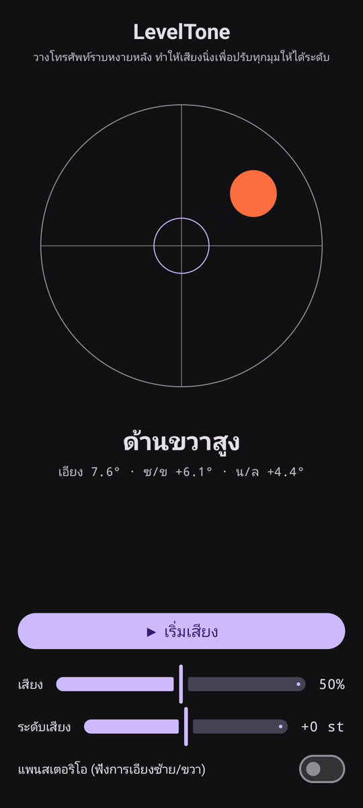

# LevelTone

🌐 ภาษา: [English](README.md) · [Nederlands](README.nl.md) · [Deutsch](README.de.md) · [Français](README.fr.md) · [Español](README.es.md) · [Português](README.pt.md) · [Italiano](README.it.md) · [Polski](README.pl.md) · [Русский](README.ru.md) · [Українська](README.uk.md) · [Türkçe](README.tr.md) · [Svenska](README.sv.md) · [Dansk](README.da.md) · [Norsk](README.nb.md) · [Suomi](README.fi.md) · [Čeština](README.cs.md) · [Ελληνικά](README.el.md) · [Română](README.ro.md) · [Magyar](README.hu.md) · [日本語](README.ja.md) · [한국어](README.ko.md) · [简体中文](README.zh-cn.md) · [繁體中文](README.zh-tw.md) · [العربية](README.ar.md) · [עברית](README.he.md) · [हिन्दी](README.hi.md) · **ไทย** · [Tiếng Việt](README.vi.md) · [Bahasa Indonesia](README.id.md) · [فارسی](README.fa.md)

> ⚠️ 🌐 *คำแปลนี้จัดทำโดยเครื่องและยังไม่ได้ตรวจทานโดยเจ้าของภาษา เห็นข้อผิดพลาด? ยินดีรับการแก้ไข — เปิด [PR](../../pulls)*

**ระดับน้ำแบบมีเสียง** สำหรับ Android วางโทรศัพท์ราบหงายหลัง แล้วให้หูของคุณทำหน้าที่
ปรับระดับ เสียงสังเคราะห์ต่อเนื่องบอกว่าพื้นผิวเอียงออกจากระดับมากแค่ไหน และเสียง **ปิ๊ง** ของ
กระดิ่งยืนยันจังหวะที่ทั้งสี่มุมได้ระดับ

## สาธิต (30 วิ)

**[▶ ดูวิดีโอสาธิต 30 วินาที](https://github.com/youforge-max/LevelTone/raw/main/docs/LevelTone-demo-th.mp4)** — โทรศัพท์เอียง ฟองอากาศ
เคลื่อนไปทางขอบที่สูง แล้วนิ่งอยู่กลางเป้าเป็นสีเขียวเมื่อได้ระดับ

> ⚠️ **วิดีโอสาธิตไม่มีเสียง** การบันทึกหน้าจอของ Android ไม่สามารถจับเสียงที่แอปสร้างขึ้นได้
> วิดีโอจึงเงียบ บนโทรศัพท์จริงคุณจะ *ได้ยิน* เสียงไต่ขึ้นสู่ระดับเสียงที่คงที่ และเสียง **ปิ๊ง**
> ของกระดิ่งเมื่อได้ระดับ — นั่นคือหัวใจของแอปนี้

## ทำงานอย่างไร

- **เสียงต่อเนื่อง** — ห่างจากระดับมาก → ระดับเสียงต่ำพร้อมการสั่นเร็ว เมื่อเข้าใกล้ระดับเสียงจะ
  สูงขึ้นและการสั่นช้าลง **ได้ระดับพอดี → เสียงสูงที่คงที่** (1318 Hz)
- **ปิ๊งได้ระดับ** — เสียงกระดิ่งที่ค่อย ๆ จางดังทุกครั้งที่เข้าสู่ระดับ คุณจึงไม่ต้องมองหน้าจอเลย
- **การบอกทิศทาง** — ระดับน้ำบนหน้าจอพร้อมป้ายกำกับ
  (`ขอบบนสูง`, `ด้านซ้ายสูง`, … → `ได้ระดับ`)
- **แถบเลื่อนระดับเสียง**, แถบเลื่อน **ปรับระดับเสียงได้** (±1 อ็อกเทฟ) และ **แพนสเตอริโอเสริม**
  ที่เลื่อนเสียงไปซ้าย/ขวาตามการเอียง

ออฟไลน์อย่างสมบูรณ์ — ไม่มีเครือข่าย ไม่มีสิทธิ์อื่นนอกจากเซนเซอร์การเคลื่อนไหว

## ติดตั้ง (ไซด์โหลด)

LevelTone **ไม่มีใน Play Store** — คุณติดตั้งด้วยการไซด์โหลด:

1. ดาวน์โหลด **`LevelTone.apk`** จาก[รุ่นล่าสุด](../../releases/latest)
2. เปิดไฟล์ หาก Android เตือน ให้แตะ **การตั้งค่า → อนุญาตจากแหล่งนี้** แล้วยืนยัน **ติดตั้ง**
3. เปิดแอป

## ควรรู้ไว้

- **ฟรี** — ไม่มีค่าใช้จ่าย ไม่มีบัญชี
- **ไม่มีโฆษณา** — ไม่มีเลย ไม่มีตัวติดตาม ไม่มีเครือข่าย
- **ไม่มีการสนับสนุน** — แอปงานอดิเรก ตามสภาพ ไม่รับประกันการสนับสนุนหรืออัปเดต แต่ถึงอย่างนั้น
  **ยินดีรับรายงานข้อบกพร่องและ pull request** — เปิด [issue](../../issues) หรือ [PR](../../pulls)

---

📘 Manual / 手册 / دليل: [English](MANUAL.md) · [Nederlands](MANUAL.nl.md) · [Deutsch](MANUAL.de.md) · [Français](MANUAL.fr.md) · [Español](MANUAL.es.md) · [Português](MANUAL.pt.md) · [Italiano](MANUAL.it.md) · [Polski](MANUAL.pl.md) · [Русский](MANUAL.ru.md) · [Українська](MANUAL.uk.md) · [Türkçe](MANUAL.tr.md) · [Svenska](MANUAL.sv.md) · [Dansk](MANUAL.da.md) · [Norsk](MANUAL.nb.md) · [Suomi](MANUAL.fi.md) · [Čeština](MANUAL.cs.md) · [Ελληνικά](MANUAL.el.md) · [Română](MANUAL.ro.md) · [Magyar](MANUAL.hu.md) · [日本語](MANUAL.ja.md) · [한국어](MANUAL.ko.md) · [简体中文](MANUAL.zh-cn.md) · [繁體中文](MANUAL.zh-tw.md) · [العربية](MANUAL.ar.md) · [עברית](MANUAL.he.md) · [हिन्दी](MANUAL.hi.md) · [ไทย](MANUAL.th.md) · [Tiếng Việt](MANUAL.vi.md) · [Bahasa Indonesia](MANUAL.id.md) · [فارسی](MANUAL.fa.md)  
🔧 Build instructions, tilt math & license: see the [English README](README.md).

