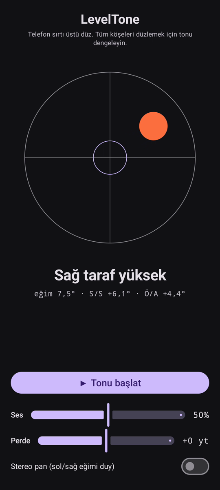

# LevelTone

🌐 Diller: [English](README.md) · [Nederlands](README.nl.md) · [Deutsch](README.de.md) · [Français](README.fr.md) · [Español](README.es.md) · [Português](README.pt.md) · [Italiano](README.it.md) · [Polski](README.pl.md) · [Русский](README.ru.md) · [Українська](README.uk.md) · **Türkçe** · [Svenska](README.sv.md) · [Dansk](README.da.md) · [Norsk](README.nb.md) · [Suomi](README.fi.md) · [Čeština](README.cs.md) · [Ελληνικά](README.el.md) · [Română](README.ro.md) · [Magyar](README.hu.md) · [日本語](README.ja.md) · [한국어](README.ko.md) · [简体中文](README.zh-cn.md) · [繁體中文](README.zh-tw.md) · [العربية](README.ar.md) · [עברית](README.he.md) · [हिन्दी](README.hi.md) · [ไทย](README.th.md) · [Tiếng Việt](README.vi.md) · [Bahasa Indonesia](README.id.md) · [فارسی](README.fa.md)

> ⚠️ 🌐 *Bu çeviri makine desteklidir ve ana dili konuşan biri tarafından gözden geçirilmemiştir. Hata mı gördün? Düzeltmeler memnuniyetle karşılanır — bir [PR](../../pulls) aç.*

Android için **sesli su terazisi**. Telefonu sırtı üstü düz koy ve tesviyeyi
kulaklarına bırak: sürekli bir sentez tonu yüzeyin ne kadar eğik olduğunu gösterir ve bir
çan **bip**'i dört köşenin de tesviye olduğu anı doğrular.

## Tanıtım (30 sn)

**[▶ 30 saniyelik tanıtımı izle](https://github.com/youforge-max/LevelTone/raw/main/docs/LevelTone-demo-tr.mp4)** — telefon eğilir, kabarcık
yüksek kenara kayar, sonra tesviye olunca hedefte yeşil ortalanmış olarak durulur.

> ⚠️ **Tanıtımın sesi yok.** Android'in ekran kaydı bir uygulamanın ürettiği sesi
> yakalayamadığından video sessizdir. Gerçek bir telefonda tonun kararlı bir perdeye
> yükseldiğini ve tesviyede çan **bip**'ini *duyardın* — uygulamanın tüm amacı bu.

## Nasıl çalışır

- **Sürekli ton** — tesviyeden çok uzak → hızlı titreşimli alçak perde; tesviyeye yaklaştıkça
  perde yükselir ve titreşim yavaşlar; **tam tesviye → yüksek, kararlı bir ton** (1318 Hz).
- **Tesviye bipi** — her tesviyeye geçişte sönümlenen bir çan sesi çalar, böylece ekrana
  bakman bile gerekmez.
- **Yön göstergesi** — ekranda bir su terazisi ve bir etiket
  (`Üst kenar yüksek`, `Sol taraf yüksek`, … → `DÜZ`).
- **Ses kaydırıcısı**, **ayarlanabilir perde** kaydırıcısı (±1 oktav) ve eğime göre tonu
  sola/sağa kaydıran **isteğe bağlı stereo pan**.

Tamamen çevrimdışı — ağ yok, hareket sensörü dışında izin yok.

## Kurulum (sideload)

LevelTone **Play Store'da değil** — sideload ile kurulur:

1. **`LevelTone.apk`**'yı [en son sürümden](../../releases/latest) indir.
2. Dosyayı aç. Android uyarırsa **Ayarlar → Bu kaynağa izin ver**'e dokun ve **Yükle**'yi onayla.
3. Uygulamayı aç.

## Bilmekte fayda var

- **Ücretsiz** — ücret yok, hesap yok.
- **Reklamsız** — asla. İzleyici yok, ağ yok.
- **Destek yok** — hobi uygulaması, olduğu gibi, destek veya güncelleme garantisi olmadan.
  Yine de **hata bildirimleri ve pull request'ler memnuniyetle karşılanır** — bir
  [issue](../../issues) veya [PR](../../pulls) aç.

---

📘 Manual / 手册 / دليل: [English](MANUAL.md) · [Nederlands](MANUAL.nl.md) · [Deutsch](MANUAL.de.md) · [Français](MANUAL.fr.md) · [Español](MANUAL.es.md) · [Português](MANUAL.pt.md) · [Italiano](MANUAL.it.md) · [Polski](MANUAL.pl.md) · [Русский](MANUAL.ru.md) · [Українська](MANUAL.uk.md) · [Türkçe](MANUAL.tr.md) · [Svenska](MANUAL.sv.md) · [Dansk](MANUAL.da.md) · [Norsk](MANUAL.nb.md) · [Suomi](MANUAL.fi.md) · [Čeština](MANUAL.cs.md) · [Ελληνικά](MANUAL.el.md) · [Română](MANUAL.ro.md) · [Magyar](MANUAL.hu.md) · [日本語](MANUAL.ja.md) · [한국어](MANUAL.ko.md) · [简体中文](MANUAL.zh-cn.md) · [繁體中文](MANUAL.zh-tw.md) · [العربية](MANUAL.ar.md) · [עברית](MANUAL.he.md) · [हिन्दी](MANUAL.hi.md) · [ไทย](MANUAL.th.md) · [Tiếng Việt](MANUAL.vi.md) · [Bahasa Indonesia](MANUAL.id.md) · [فارسی](MANUAL.fa.md)  
🔧 Build instructions, tilt math & license: see the [English README](README.md).

