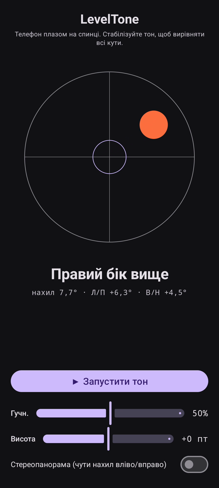

# LevelTone

🌐 Мови: [English](README.md) · [Nederlands](README.nl.md) · [Deutsch](README.de.md) · [Français](README.fr.md) · [Español](README.es.md) · [Português](README.pt.md) · [Italiano](README.it.md) · [Polski](README.pl.md) · [Русский](README.ru.md) · **Українська** · [Türkçe](README.tr.md) · [Svenska](README.sv.md) · [Dansk](README.da.md) · [Norsk](README.nb.md) · [Suomi](README.fi.md) · [Čeština](README.cs.md) · [Ελληνικά](README.el.md) · [Română](README.ro.md) · [Magyar](README.hu.md) · [日本語](README.ja.md) · [한국어](README.ko.md) · [简体中文](README.zh-cn.md) · [繁體中文](README.zh-tw.md) · [العربية](README.ar.md) · [עברית](README.he.md) · [हिन्दी](README.hi.md) · [ไทย](README.th.md) · [Tiếng Việt](README.vi.md) · [Bahasa Indonesia](README.id.md) · [فارسی](README.fa.md)

> ⚠️ 🌐 *Цей переклад зроблено машиною й не перевірено носієм мови. Помітили помилку? Виправлення вітаються — відкрийте [PR](../../pulls).*

**Звуковий рівень** для Android. Покладіть телефон плазом на спинку й дозвольте
вухам виконувати вирівнювання: неперервний синтезований тон показує, наскільки поверхня
відхилена від горизонталі, а **дзвінок**-сигнал підтверджує момент, коли всі чотири кути
вирівняні.

## Демонстрація (30 с)

**[▶ Дивитися 30-секундну демонстрацію](https://github.com/youforge-max/LevelTone/raw/main/docs/LevelTone-demo-uk.mp4)** — телефон
нахиляється, бульбашка зміщується до високого краю, потім зелено зупиняється по центру цілі,
коли досягає горизонталі.

> ⚠️ **У демонстрації немає звуку.** Запис екрана Android не може захопити згенерований
> застосунком звук, тому відео беззвучне. На справжньому телефоні ви б *почули*, як тон
> піднімається до стабільної висоти, і **дзвінок** при вирівнюванні — у цьому весь сенс.

## Як це працює

- **Неперервний тон** — далеко від горизонталі → низька висота зі швидким дрижанням; при
  наближенні висота зростає, а дрижання сповільнюється; **точна горизонталь → високий, рівний
  тон** (1318 Гц).
- **Сигнал рівня** — згасаючий дзвін лунає щоразу при досягненні горизонталі, тож на екран
  можна навіть не дивитися.
- **Індикація напрямку** — рівень із бульбашкою на екрані плюс мітка
  (`Верхній край вище`, `Лівий бік вище`, … → `РІВНО`).
- **Повзунок гучності**, повзунок **регульованої висоти** (±1 октава) та **необов'язкова
  стереопанорама**, що зсуває тон ліворуч/праворуч із нахилом.

Повністю офлайн — без мережі, без дозволів, окрім датчика руху.

## Встановлення (sideload)

LevelTone **немає в Play Маркеті** — встановлюється через sideload:

1. Завантажте **`LevelTone.apk`** з [останнього випуску](../../releases/latest).
2. Відкрийте файл. Якщо Android попереджає, торкніться **Налаштування → Дозволити з цього
   джерела** і підтвердьте **Встановити**.
3. Відкрийте застосунок.

## Корисно знати

- **Безкоштовно** — без оплати й акаунтів.
- **Без реклами** — ніколи. Без трекерів, без мережі.
- **Без підтримки** — аматорський застосунок, як є, без гарантії підтримки чи оновлень. Втім,
  **звіти про помилки та pull-запити вітаються** — відкрийте [issue](../../issues) або
  [PR](../../pulls).

---

📘 Manual / 手册 / دليل: [English](MANUAL.md) · [Nederlands](MANUAL.nl.md) · [Deutsch](MANUAL.de.md) · [Français](MANUAL.fr.md) · [Español](MANUAL.es.md) · [Português](MANUAL.pt.md) · [Italiano](MANUAL.it.md) · [Polski](MANUAL.pl.md) · [Русский](MANUAL.ru.md) · [Українська](MANUAL.uk.md) · [Türkçe](MANUAL.tr.md) · [Svenska](MANUAL.sv.md) · [Dansk](MANUAL.da.md) · [Norsk](MANUAL.nb.md) · [Suomi](MANUAL.fi.md) · [Čeština](MANUAL.cs.md) · [Ελληνικά](MANUAL.el.md) · [Română](MANUAL.ro.md) · [Magyar](MANUAL.hu.md) · [日本語](MANUAL.ja.md) · [한국어](MANUAL.ko.md) · [简体中文](MANUAL.zh-cn.md) · [繁體中文](MANUAL.zh-tw.md) · [العربية](MANUAL.ar.md) · [עברית](MANUAL.he.md) · [हिन्दी](MANUAL.hi.md) · [ไทย](MANUAL.th.md) · [Tiếng Việt](MANUAL.vi.md) · [Bahasa Indonesia](MANUAL.id.md) · [فارسی](MANUAL.fa.md)  
🔧 Build instructions, tilt math & license: see the [English README](README.md).

