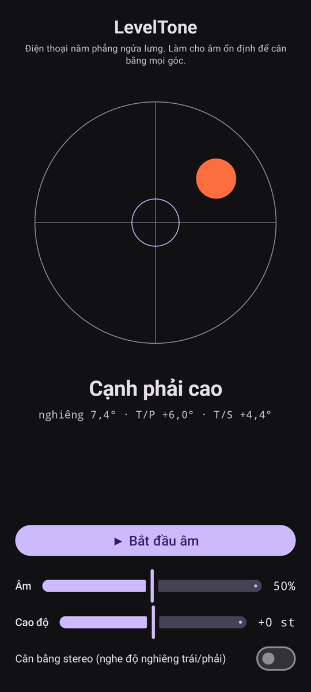

# LevelTone

🌐 Ngôn ngữ: [English](README.md) · [Nederlands](README.nl.md) · [Deutsch](README.de.md) · [Français](README.fr.md) · [Español](README.es.md) · [Português](README.pt.md) · [Italiano](README.it.md) · [Polski](README.pl.md) · [Русский](README.ru.md) · [Українська](README.uk.md) · [Türkçe](README.tr.md) · [Svenska](README.sv.md) · [Dansk](README.da.md) · [Norsk](README.nb.md) · [Suomi](README.fi.md) · [Čeština](README.cs.md) · [Ελληνικά](README.el.md) · [Română](README.ro.md) · [Magyar](README.hu.md) · [日本語](README.ja.md) · [한국어](README.ko.md) · [简体中文](README.zh-cn.md) · [繁體中文](README.zh-tw.md) · [العربية](README.ar.md) · [עברית](README.he.md) · [हिन्दी](README.hi.md) · [ไทย](README.th.md) · **Tiếng Việt** · [Bahasa Indonesia](README.id.md) · [فارسی](README.fa.md)

> ⚠️ 🌐 *Bản dịch này do máy hỗ trợ và chưa được người bản ngữ rà soát. Thấy lỗi? Rất hoan nghênh chỉnh sửa — mở một [PR](../../pulls).*

Một **thước thủy âm thanh** cho Android. Đặt điện thoại nằm phẳng ngửa lưng và để
đôi tai cân bằng giúp bạn: một âm tổng hợp liên tục cho biết mặt phẳng lệch bao nhiêu so với
mực ngang, và một tiếng chuông **bíp** xác nhận khoảnh khắc cả bốn góc cân bằng.

## Video demo (30 giây)

**[▶ Xem video demo 30 giây](https://github.com/youforge-max/LevelTone/raw/main/docs/LevelTone-demo-vi.mp4)** — điện thoại nghiêng, bọt
nước trôi về cạnh cao, rồi ổn định ở giữa mục tiêu với màu xanh khi cân bằng.

> ⚠️ **Video demo không có âm thanh.** Bản ghi màn hình của Android không thể thu âm thanh do
> ứng dụng tạo ra, nên video bị câm. Trên điện thoại thật bạn sẽ *nghe* âm thanh dâng lên một
> cao độ ổn định và tiếng chuông **bíp** khi cân bằng — đó chính là toàn bộ ý nghĩa của ứng dụng.

## Cách hoạt động

- **Âm liên tục** — lệch xa mực ngang → cao độ thấp với dao động nhanh; càng gần cân bằng cao
  độ càng lên và dao động chậm lại; **cân bằng chính xác → một âm cao, ổn định** (1318 Hz).
- **Bíp cân bằng** — một tiếng chuông tắt dần vang lên mỗi khi bạn đạt cân bằng, nên bạn thậm
  chí không cần nhìn màn hình.
- **Chỉ dẫn hướng** — một thước thủy trên màn hình cùng nhãn
  (`Cạnh trên cao`, `Cạnh trái cao`, … → `CÂN BẰNG`).
- **Thanh trượt âm lượng**, thanh trượt **cao độ điều chỉnh được** (±1 quãng tám), và **cân bằng
  stereo tùy chọn** dịch âm sang trái/phải theo độ nghiêng.

Hoàn toàn ngoại tuyến — không mạng, không quyền nào ngoài cảm biến chuyển động.

## Cài đặt (sideload)

LevelTone **không có trên Play Store** — bạn cài bằng sideload:

1. Tải **`LevelTone.apk`** từ [bản phát hành mới nhất](../../releases/latest).
2. Mở tệp. Nếu Android cảnh báo, chạm **Cài đặt → Cho phép từ nguồn này** rồi xác nhận **Cài đặt**.
3. Mở ứng dụng.

## Nên biết

- **Miễn phí** — không phí, không tài khoản.
- **Không quảng cáo** — không bao giờ. Không trình theo dõi, không mạng.
- **Không hỗ trợ** — ứng dụng nghiệp dư, nguyên trạng, không bảo đảm hỗ trợ hay cập nhật. Dù vậy
  **báo lỗi và pull request luôn được hoan nghênh** — mở một [issue](../../issues) hoặc
  [PR](../../pulls).

---

📘 Manual / 手册 / دليل: [English](MANUAL.md) · [Nederlands](MANUAL.nl.md) · [Deutsch](MANUAL.de.md) · [Français](MANUAL.fr.md) · [Español](MANUAL.es.md) · [Português](MANUAL.pt.md) · [Italiano](MANUAL.it.md) · [Polski](MANUAL.pl.md) · [Русский](MANUAL.ru.md) · [Українська](MANUAL.uk.md) · [Türkçe](MANUAL.tr.md) · [Svenska](MANUAL.sv.md) · [Dansk](MANUAL.da.md) · [Norsk](MANUAL.nb.md) · [Suomi](MANUAL.fi.md) · [Čeština](MANUAL.cs.md) · [Ελληνικά](MANUAL.el.md) · [Română](MANUAL.ro.md) · [Magyar](MANUAL.hu.md) · [日本語](MANUAL.ja.md) · [한국어](MANUAL.ko.md) · [简体中文](MANUAL.zh-cn.md) · [繁體中文](MANUAL.zh-tw.md) · [العربية](MANUAL.ar.md) · [עברית](MANUAL.he.md) · [हिन्दी](MANUAL.hi.md) · [ไทย](MANUAL.th.md) · [Tiếng Việt](MANUAL.vi.md) · [Bahasa Indonesia](MANUAL.id.md) · [فارسی](MANUAL.fa.md)  
🔧 Build instructions, tilt math & license: see the [English README](README.md).

