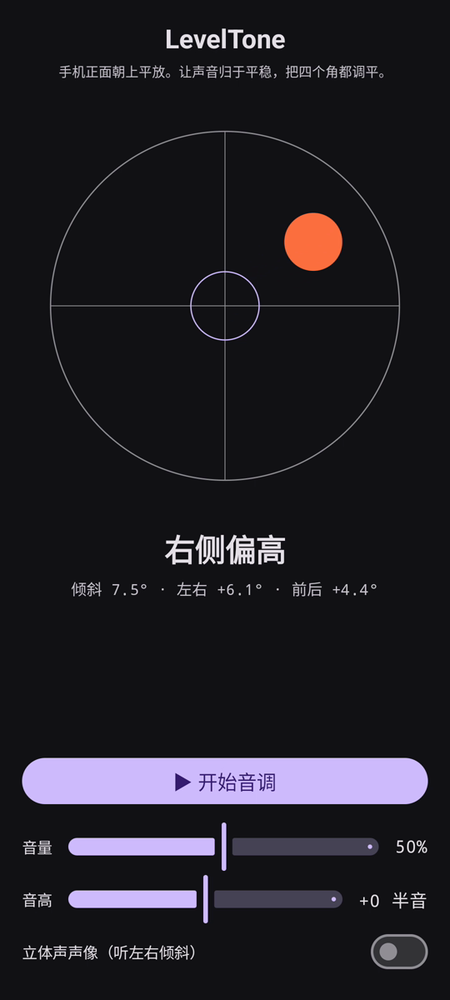

# LevelTone

🌐 语言: [English](README.md) · [Nederlands](README.nl.md) · [Deutsch](README.de.md) · [Français](README.fr.md) · [Español](README.es.md) · [Português](README.pt.md) · [Italiano](README.it.md) · [Polski](README.pl.md) · [Русский](README.ru.md) · [Українська](README.uk.md) · [Türkçe](README.tr.md) · [Svenska](README.sv.md) · [Dansk](README.da.md) · [Norsk](README.nb.md) · [Suomi](README.fi.md) · [Čeština](README.cs.md) · [Ελληνικά](README.el.md) · [Română](README.ro.md) · [Magyar](README.hu.md) · [日本語](README.ja.md) · [한국어](README.ko.md) · **简体中文** · [繁體中文](README.zh-tw.md) · [العربية](README.ar.md) · [עברית](README.he.md) · [हिन्दी](README.hi.md) · [ไทย](README.th.md) · [Tiếng Việt](README.vi.md) · [Bahasa Indonesia](README.id.md) · [فارسی](README.fa.md)

> ⚠️ 🌐 *本翻译由机器辅助完成，未经母语者审校。发现错误？欢迎更正——提交一个 [PR](../../pulls)。*

一款 Android **有声水平仪**。把手机正面朝上平放，让耳朵来找平：连续的合成音提示
表面偏离水平的程度，一声铃**叮**确认四个角都水平的那一刻。

## 演示（30 秒）

**[▶ 观看 30 秒演示](https://github.com/youforge-max/LevelTone/raw/main/docs/LevelTone-demo-zh-cn.mp4)** — 手机倾斜时气泡漂向高的一侧，
达到水平后在靶心上以绿色居中停稳。

> ⚠️ **演示没有声音。** Android 的屏幕录制无法捕捉应用生成的声音，因此视频是静音的。在真机上你会
> *听到* 音调升到稳定的高度，并在水平时听到铃**叮**——这正是本应用的意义所在。

## 工作原理

- **连续音** — 离水平越远 → 音调越低、抖动越快；越接近水平，音调越高、抖动越慢；**恰好水平 →
  高而稳定的音**（1318 Hz）。
- **水平叮声** — 每次进入水平都会响起一声渐弱的铃声，你甚至不用看屏幕。
- **方向提示** — 屏幕上的气泡水平仪加一个标签（`上边偏高`、`左侧偏高`、… → `已水平`）。
- **音量滑块**、**可调音高**滑块（±1 个八度），以及随倾斜把声音左右平移的**可选立体声声像**。

完全离线——无网络，除运动传感器外无任何权限。

## 安装（旁加载）

LevelTone **不在 Play 商店** — 通过旁加载安装：

1. 从[最新版本](../../releases/latest)下载 **`LevelTone.apk`**。
2. 打开该文件。若 Android 提示，点按 **设置 → 允许此来源**，然后确认 **安装**。
3. 打开应用。

## 需要了解

- **免费** — 无费用，无账户。
- **无广告** — 永远。无追踪器，无网络。
- **无支持** — 业余应用，按原样提供，不保证支持或更新。不过 **欢迎提交错误报告和拉取请求** —
  提交 [issue](../../issues) 或 [PR](../../pulls)。

---

📘 Manual / 手册 / دليل: [English](MANUAL.md) · [Nederlands](MANUAL.nl.md) · [Deutsch](MANUAL.de.md) · [Français](MANUAL.fr.md) · [Español](MANUAL.es.md) · [Português](MANUAL.pt.md) · [Italiano](MANUAL.it.md) · [Polski](MANUAL.pl.md) · [Русский](MANUAL.ru.md) · [Українська](MANUAL.uk.md) · [Türkçe](MANUAL.tr.md) · [Svenska](MANUAL.sv.md) · [Dansk](MANUAL.da.md) · [Norsk](MANUAL.nb.md) · [Suomi](MANUAL.fi.md) · [Čeština](MANUAL.cs.md) · [Ελληνικά](MANUAL.el.md) · [Română](MANUAL.ro.md) · [Magyar](MANUAL.hu.md) · [日本語](MANUAL.ja.md) · [한국어](MANUAL.ko.md) · [简体中文](MANUAL.zh-cn.md) · [繁體中文](MANUAL.zh-tw.md) · [العربية](MANUAL.ar.md) · [עברית](MANUAL.he.md) · [हिन्दी](MANUAL.hi.md) · [ไทย](MANUAL.th.md) · [Tiếng Việt](MANUAL.vi.md) · [Bahasa Indonesia](MANUAL.id.md) · [فارسی](MANUAL.fa.md)  
🔧 Build instructions, tilt math & license: see the [English README](README.md).

