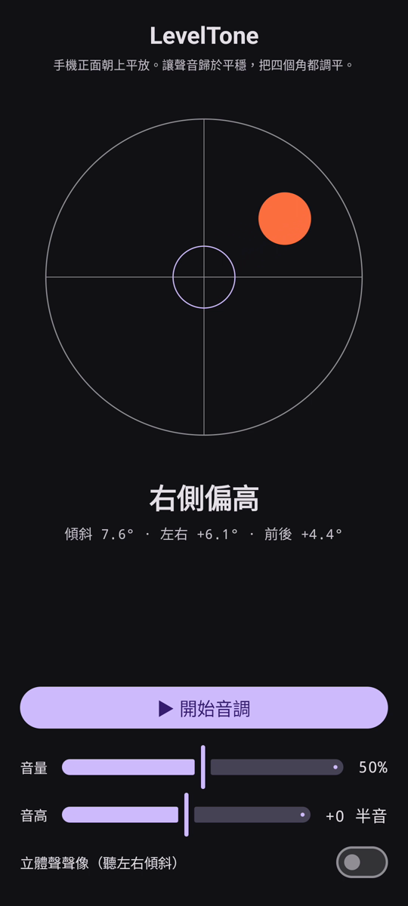

# LevelTone

🌐 語言: [English](README.md) · [Nederlands](README.nl.md) · [Deutsch](README.de.md) · [Français](README.fr.md) · [Español](README.es.md) · [Português](README.pt.md) · [Italiano](README.it.md) · [Polski](README.pl.md) · [Русский](README.ru.md) · [Українська](README.uk.md) · [Türkçe](README.tr.md) · [Svenska](README.sv.md) · [Dansk](README.da.md) · [Norsk](README.nb.md) · [Suomi](README.fi.md) · [Čeština](README.cs.md) · [Ελληνικά](README.el.md) · [Română](README.ro.md) · [Magyar](README.hu.md) · [日本語](README.ja.md) · [한국어](README.ko.md) · [简体中文](README.zh-cn.md) · **繁體中文** · [العربية](README.ar.md) · [עברית](README.he.md) · [हिन्दी](README.hi.md) · [ไทย](README.th.md) · [Tiếng Việt](README.vi.md) · [Bahasa Indonesia](README.id.md) · [فارسی](README.fa.md)

> ⚠️ 🌐 *本翻譯由機器輔助完成，未經母語者審校。發現錯誤？歡迎更正——提交一個 [PR](../../pulls)。*

一款 Android **有聲水平儀**。把手機正面朝上平放，讓耳朵來找平：連續的合成音提示
表面偏離水平的程度，一聲鈴**叮**確認四個角都水平的那一刻。

## 示範（30 秒）

**[▶ 觀看 30 秒示範](https://github.com/youforge-max/LevelTone/raw/main/docs/LevelTone-demo-zh-tw.mp4)** — 手機傾斜時氣泡漂向高的一側，
達到水平後在靶心上以綠色置中停穩。

> ⚠️ **示範沒有聲音。** Android 的螢幕錄製無法擷取應用程式產生的聲音，因此影片是靜音的。在實機上
> 你會 *聽到* 音調升到穩定的高度，並在水平時聽到鈴**叮**——這正是本應用程式的意義所在。

## 運作原理

- **連續音** — 離水平越遠 → 音調越低、抖動越快；越接近水平，音調越高、抖動越慢；**恰好水平 →
  高而穩定的音**（1318 Hz）。
- **水平叮聲** — 每次進入水平都會響起一聲漸弱的鈴聲，你甚至不用看螢幕。
- **方向提示** — 螢幕上的氣泡水平儀加一個標籤（`上緣偏高`、`左側偏高`、… → `已水平`）。
- **音量滑桿**、**可調音高**滑桿（±1 個八度），以及隨傾斜把聲音左右平移的**可選立體聲聲像**。

完全離線——無網路，除運動感測器外無任何權限。

## 安裝（側載）

LevelTone **不在 Play 商店** — 透過側載安裝：

1. 從[最新版本](../../releases/latest)下載 **`LevelTone.apk`**。
2. 開啟該檔案。若 Android 提示，點按 **設定 → 允許此來源**，然後確認 **安裝**。
3. 開啟應用程式。

## 需要了解

- **免費** — 無費用，無帳戶。
- **無廣告** — 永遠。無追蹤器，無網路。
- **無支援** — 業餘應用程式，按原樣提供，不保證支援或更新。不過 **歡迎提交錯誤報告和拉取請求** —
  提交 [issue](../../issues) 或 [PR](../../pulls)。

---

📘 Manual / 手册 / دليل: [English](MANUAL.md) · [Nederlands](MANUAL.nl.md) · [Deutsch](MANUAL.de.md) · [Français](MANUAL.fr.md) · [Español](MANUAL.es.md) · [Português](MANUAL.pt.md) · [Italiano](MANUAL.it.md) · [Polski](MANUAL.pl.md) · [Русский](MANUAL.ru.md) · [Українська](MANUAL.uk.md) · [Türkçe](MANUAL.tr.md) · [Svenska](MANUAL.sv.md) · [Dansk](MANUAL.da.md) · [Norsk](MANUAL.nb.md) · [Suomi](MANUAL.fi.md) · [Čeština](MANUAL.cs.md) · [Ελληνικά](MANUAL.el.md) · [Română](MANUAL.ro.md) · [Magyar](MANUAL.hu.md) · [日本語](MANUAL.ja.md) · [한국어](MANUAL.ko.md) · [简体中文](MANUAL.zh-cn.md) · [繁體中文](MANUAL.zh-tw.md) · [العربية](MANUAL.ar.md) · [עברית](MANUAL.he.md) · [हिन्दी](MANUAL.hi.md) · [ไทย](MANUAL.th.md) · [Tiếng Việt](MANUAL.vi.md) · [Bahasa Indonesia](MANUAL.id.md) · [فارسی](MANUAL.fa.md)  
🔧 Build instructions, tilt math & license: see the [English README](README.md).

